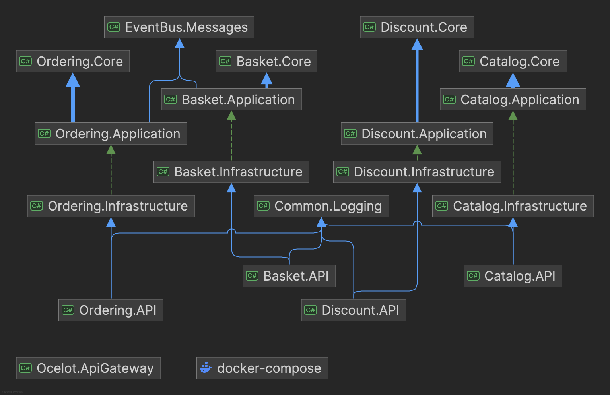

# Cloud-Native E-commerce Platform

## Overview

A comprehensive e-commerce solution built using microservices architecture with .NET Core. This project demonstrates enterprise-level application development using modern architecture patterns, containerization, and cloud-native practices.

## Vision

A cloud-native microservices e-commerce system leveraging Kubernetes for container orchestration, Helm for deployment automation, and Elastic Stack for comprehensive monitoring, providing a scalable, resilient and easily manageable platform.

## Goals

- Create a fully containerized microservices architecture following Clean Architecture principles
- Implement robust deployment pipelines with Kubernetes and Helm charts
- Establish comprehensive monitoring and logging with Elastic Stack
- Enable service-to-service communication through message brokers and API gateways
- Ensure high availability, scalability, and fault tolerance through Kubernetes orchestration
- Implement Istio service mesh for enhanced network communication and observability
- Build a responsive and modern e-commerce interface using Angular

## Architecture Diagrams

### Dependencies Structure



The solution follows a clean layered architecture pattern with microservices:

### Services (Microservices)

Each microservice follows the same layered architecture pattern:

#### Basket Service

- **Basket.API**: REST API endpoints for basket operations
- **Basket.Application**: Application logic and business workflows
- **Basket.Core**: Domain models and business logic
- **Basket.Infrastructure**: External concerns, data access, and infrastructure

#### Catalog Service

- **Catalog.API**: REST API endpoints for product catalog
- **Catalog.Application**: Application layer business logic
- **Catalog.Core**: Core domain models and rules
- **Catalog.Infrastructure**: Data persistence and external services

#### Discount Service

- **Discount.API**: REST API for discount management
- **Discount.Application**: Discount processing logic
- **Discount.Core**: Core discount rules and models
- **Discount.Infrastructure**: Data access and external integrations

#### Ordering Service

- **Ordering.API**: Order management REST endpoints
- **Ordering.Application**: Order processing workflows
- **Ordering.Core**: Order domain models and rules
- **Ordering.Infrastructure**: Order persistence and integration

### System Architecture


The system implements:

#### Client Layer

- Angular-based front-end application
- Integration with Identity Server
- Communication through Ocelot API Gateway

#### API Gateway Layer

- Ocelot API Gateway for routing and aggregation
- Single entry point for all client requests

#### Microservices Layer

Each service has its own:

- REST API endpoints
- Application logic
- Domain models
- Infrastructure concerns
- Database:
  - Catalog: MongoDB
  - Basket: Redis
  - Discount: PostgreSQL
  - Ordering: SQL Server

#### Message Bus

- RabbitMQ for asynchronous communication
- Event-driven architecture between services

## Technical Stack

### Backend

- .NET Core 8.0
- Clean Architecture
- CQRS Pattern
- Entity Framework Core
- Dapper
- AutoMapper

### Databases

- MongoDB
- Redis
- PostgreSQL
- MS SQL Server

### Message Broker

- RabbitMQ

### Frontend

- Angular
- TypeScript
- Material UI/Tailwind CSS

### API Gateway

- Ocelot
- JWT Authentication
- Rate Limiting
- Load Balancing

### Monitoring & Logging

- Elasticsearch
- Kibana
- Common.Logging
- Health Checks

### Containerization & Orchestration

- Docker
- Docker Compose
- Kubernetes
- Helm Charts
- Istio Service Mesh

### Development Tools

- Visual Studio 2022
- VS Code
- Git
- GitHub Actions

## Epics and Features

### Epic 1: Product Management
- **Catalog Management** - CRUD operations for products with MongoDB
- **Brand Management** - Organization and administration of product brands
- **Product Type Management** - Categorization and typing of products
- **Product Search and Filter** - Advanced discovery capabilities

### Epic 2: Shopping Experience
- **Product Browsing** - Intuitive product discovery and display
- **Shopping Cart** - Redis-backed persistent cart management

### Epic 3: Order Processing
- **Checkout Process** - Convert carts to orders using RabbitMQ event-driven architecture
- **Order Management** - SQL Server-based order tracking and history

### Epic 4: Discount Management
- **Discount Application** - Apply percentage or fixed discounts to products

### Epic 5: User Management and Authentication
- **User Registration and Login** - Identity Server 4 integration

### Epic 6: System Operations
- **Deployment Automation** - Kubernetes and Helm chart deployment
- **System Monitoring** - Elastic Stack observability
- **Scaling and Resilience** - Kubernetes auto-scaling and self-healing
- **Service Mesh** - Istio-based traffic management and security

## Release Timeline

### Infrastructure Foundation (March 2025)
- Complete containerization of core microservices (Catalog, Basket)
- Set up basic Kubernetes cluster configuration
- Implement Docker Compose for local development
- Create initial CI/CD pipeline for automated builds

### Service Expansion (April 2025)
- Containerize Discount and Ordering services
- Implement Helm charts for automated deployments
- Configure RabbitMQ for message-based communication
- Set up inter-service communication patterns

### Monitoring and Resilience (May 2025)
- Set up Elastic Stack for logging
- Implement distributed tracing across services
- Configure Kubernetes horizontal pod autoscaling
- Enhance API Gateway with advanced routing and caching

### Service Mesh and Frontend (June 2025)
- Deploy Istio service mesh
- Implement advanced traffic management
- Develop and deploy Angular frontend client
- Conduct end-to-end testing and optimization

## Key Outcomes

### Product Management Outcomes
- MongoDB product database schema for flexible attributes
- Product CRUD API endpoints with image upload capability
- Brand entity model with brand-to-product relationships
- Category hierarchy model with navigation components
- Search and filtering framework for price ranges and attributes

### Shopping Experience Outcomes
- Responsive product interface with availability indicators
- Redis-backed cart persistence system
- Cart management UI with quantity controls and total calculation
- Cart expiration and recovery mechanism

### Order Processing Outcomes
- Cart-to-order conversion with RabbitMQ
- Order confirmation email system
- Order management dashboard for administrators

### Discount Management Outcomes
- Percentage and fixed-amount discount configuration
- Discount scheduling and expiration system
- Applied discount indicators in product and cart views

### User Management Outcomes
- Identity Server 4 integration with email verification
- Secure login process with rate limiting

### System Operations Outcomes
- Helm charts for each microservice with environment-specific configuration
- Elasticsearch cluster with centralized logging
- Kubernetes horizontal pod autoscaling
- Service mesh capabilities with Istio

## Setup Instructions

### Prerequisites

- .NET Core SDK 8.0
- Docker Desktop
- Node.js (for client applications)
- Git

### Development Environment Setup

1. Clone the repository:

```bash
git clone https://github.com/sloweyyy/cloud-native-ecommerce-platform.git
cd cloud-native-ecommerce-platform
```

2. Configure Docker resources:

```bash
docker-compose -f docker-compose.yml -f docker-compose.override.yml up -d
```

Required resources:

- Memory: Minimum 7GB
- CPU: Minimum 5 cores

3. Start the services:

```bash
docker-compose up
```

## Service URLs

- Catalog API: http://localhost:8000
- Basket API: http://localhost:8001
- Discount API: http://localhost:8002
- Ordering API: http://localhost:8003
- API Gateway: http://localhost:8010
- Web Client: http://localhost:4200

## Monitoring & Infrastructure URLs

- Kibana: http://localhost:5601
- Elasticsearch: http://localhost:9200
- RabbitMQ Management: http://localhost:15672
  - Username: guest
  - Password: guest
- Portainer: http://localhost:9000
- pgAdmin: http://localhost:5050
  - Email: admin@eCommerce.net
  - Password: Password@1

## Project Structure

```plaintext
├── src/
│   ├── ApiGateways/                    # API gateway layer
│   │   └── Ocelot.ApiGateway/          # Ocelot API gateway implementation
│   │        ├── Configurations/        # Gateway routing and configuration
│   │        ├── Extensions/            # Extension methods for services
│   │        └── Program.cs             # Gateway entry point
│   │
│   ├── Infrastructure/                 # Shared infrastructure components
│   │   ├── EventBus.Messages/          # Shared event messages for RabbitMQ
│   │   │    ├── Events/                # Event models for inter-service communication
│   │   │    └── Common/                # Shared constants and configurations
│   │   │
│   │   └── Common.Logging/             # Centralized logging infrastructure
│   │        ├── Extensions/            # Logging extension methods
│   │        └── SeriLogger.cs          # Serilog implementation
│   │
│   ├── Services/                       # Microservices implementations
│   │   ├── Basket/                     # Shopping cart service
│   │   │   ├── Basket.API/             # REST API endpoints and controllers
│   │   │   │    ├── Controllers/       # API controllers
│   │   │   │    ├── GrpcServices/      # gRPC clients for service communication
│   │   │   │    └── Program.cs         # Service entry point
│   │   │   │
│   │   │   ├── Basket.Application/     # Application business logic
│   │   │   │    ├── Behaviors/         # Request behaviors (validation, logging)
│   │   │   │    ├── Features/          # Application features (CQRS)
│   │   │   │    └── Mappings/          # AutoMapper profiles
│   │   │   │
│   │   │   ├── Basket.Core/            # Domain models and business rules
│   │   │   │    ├── Entities/          # Domain entities
│   │   │   │    ├── Repositories/      # Repository interfaces
│   │   │   │    └── Specifications/    # Domain specifications
│   │   │   │
│   │   │   └── Basket.Infrastructure/  # External dependencies and implementations
│   │   │        ├── Data/              # Redis implementation
│   │   │        ├── Repositories/      # Repository implementations
│   │   │        └── Extensions/        # Service extension methods
│   │   │
│   │   ├── Catalog/                    # Product catalog service
│   │   │   ├── Catalog.API/            # REST API endpoints and controllers
│   │   │   ├── Catalog.Application/    # Application business logic
│   │   │   ├── Catalog.Core/           # Domain models and rules
│   │   │   └── Catalog.Infrastructure/ # MongoDB persistence
│   │   │
│   │   ├── Discount/                   # Discount management service
│   │   │   ├── Discount.API/           # REST API endpoints
│   │   │   │    ├── Controllers/       # API controllers
│   │   │   │    ├── Extensions/        # Service extensions
│   │   │   │    └── Program.cs         # Service entry point
│   │   │   │
│   │   │   ├── Discount.Application/   # Discount processing logic
│   │   │   ├── Discount.Core/          # Core discount rules and models
│   │   │   └── Discount.Infrastructure/# PostgreSQL implementations
│   │   │
│   │   └── Ordering/                   # Order processing service
│   │       ├── Ordering.API/           # REST API endpoints
│   │       │    ├── Controllers/       # API controllers
│   │       │    ├── EventBusConsumer/  # RabbitMQ message consumers
│   │       │    └── Program.cs         # Service entry point
│   │       │
│   │       ├── Ordering.Application/   # Order workflows (CQRS with MediatR)
│   │       │    ├── Behaviors/         # Request behaviors
│   │       │    ├── Contracts/         # Interfaces
│   │       │    ├── Features/          # Commands and queries
│   │       │    └── Mappings/          # AutoMapper profiles
│   │       │
│   │       ├── Ordering.Core/          # Domain models and rules
│   │       │    ├── Entities/          # Domain entities
│   │       │    └── ValueObjects/      # Domain value objects
│   │       │
│   │       └── Ordering.Infrastructure/# SQL Server persistence
│   │            ├── Persistence/       # Database context
│   │            ├── Repositories/      # Repository implementations
│   │            └── Mail/              # Email service implementation
│   │
│   ├── client/                         # Angular frontend application
│   │    ├── src/                       # Source code
│   │    │    ├── app/                  # Angular components
│   │    │    ├── assets/               # Static assets
│   │    │    └── environments/         # Environment configurations
│   │    │
│   │    ├── package.json               # NPM dependencies
│   │    └── angular.json               # Angular configuration
│   │
│   └── images/                         # Documentation images
│        ├── dependencies-structure.png # Architecture diagram
│        └── system-architecture.png    # System architecture diagram
│
├── docker-compose.yml                  # Base Docker Compose configuration
├── docker-compose.override.yml         # Environment-specific overrides
├── Deployments/                        # Kubernetes and Helm deployment files
│    ├── helm-charts/                   # Helm charts for each service
│    └── k8s/                           # Kubernetes manifests
│
├── PostmanCollection/                  # API testing collections
├── README.md                           # Project documentation
└── LICENSE                             # MIT license
```

The project follows a clean microservices architecture with the following organizational principles:

1. **Service Isolation**: Each microservice (Basket, Catalog, Discount, Ordering) is isolated with its own data storage, business logic, and API.

2. **Clean Architecture**: Every service is structured following Clean Architecture principles with distinct layers:
   - **API Layer**: Controllers and external interfaces
   - **Application Layer**: Business workflows and application logic
   - **Core/Domain Layer**: Business entities and rules
   - **Infrastructure Layer**: Technical implementations and external concerns

3. **Shared Infrastructure**: Common components like event bus messages and logging are isolated in the Infrastructure folder to enable reuse.

4. **Gateway Pattern**: All client requests go through the Ocelot API Gateway, which handles routing, aggregation, and cross-cutting concerns.

5. **Containerization**: Each component is containerized using Docker, with configurations defined in docker-compose files.

6. **Kubernetes Deployment**: Production deployment uses Kubernetes manifests and Helm charts in the Deployments directory.

## Analytics and Performance Metrics

### Deployment Metrics
- Deployment time target: 15 minutes (from 3 hours baseline)
- Deployment success rate target: 99.5% (from 85% baseline)

### Monitoring Metrics
- Mean time to detect (MTTD) issues target: 5 minutes (from 30 minutes baseline)
- Mean time to resolve (MTTR) issues target: 1 hour (from 4 hours baseline)

## Future Work

| Feature | Purpose | Priority | Timeframe |
|---------|---------|----------|-----------|
| Advanced Service Mesh Capabilities | Implement advanced Istio features for circuit breaking, fault injection, and A/B testing | Medium | Q3 2025 |
| Machine Learning-Based Autoscaling | Implement predictive scaling based on historical patterns | Low | Q4 2025 |
| Multi-Cluster Federation | Support multi-region, multi-cluster operation | Medium | Q1 2026 |
| GitOps Deployment Pipeline | Implement GitOps principles for automated deployment | High | Q2 2026 |

## License

This project is licensed under the MIT License - see the [LICENSE](LICENSE) file for details. 