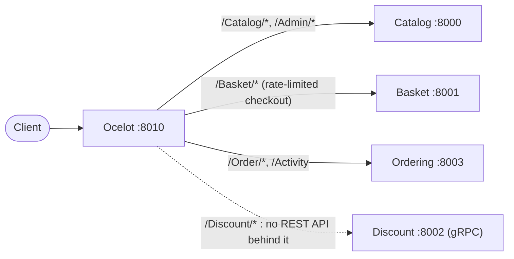

import { Aside } from '@astrojs/starlight/components';
import Src from '../../components/Src.astro';

All client traffic enters through a single ASP.NET Core application hosting **Ocelot 23.4** (<Src path="src/ApiGateways/Ocelot.ApiGateway" tree />). It translates short, client-friendly paths into the services' versioned routes, and it hides service host names and ports from the browser.

## How configuration is selected

<Src path="src/ApiGateways/Ocelot.ApiGateway/Program.cs" /> adds one extra JSON file based on the hosting environment:

```csharp
builder.Host.ConfigureAppConfiguration((env, config) =>
{
    config.AddJsonFile($"ocelot.{env.HostingEnvironment.EnvironmentName}.json", true, true);
});
builder.Services.AddOcelot();
...
await app.UseOcelot();
```

| `ASPNETCORE_ENVIRONMENT` | File | Downstream hosts | Used by |
|---|---|---|---|
| `Development` | <Src path="src/ApiGateways/Ocelot.ApiGateway/ocelot.Development.json" /> | `host.docker.internal:8000` to `8003` (the published Compose ports) | Docker Compose |
| `k8s` | <Src path="src/ApiGateways/Ocelot.ApiGateway/ocelot.k8s.json" /> | Helm release service names: `eshopping-catalog:80`, `eshopping-basket:80`, `eshopping-ordering:80`, `eshopping-discount-discount-grpc:8080` | Helm chart (<Src path="deploy/helm/ocelotapigw/values.yaml" /> sets `ASPNETCORE_ENVIRONMENT=k8s`) |
| `k8s` via ConfigMap | <Src path="deploy/k8s/gateway/ocelot-configmap.yaml" /> | `catalog-api-service:9000` and similar | Raw Kubernetes manifests, which mount their own `ocelot.k8s.json` |

The file is optional (`optional: true`) and reloads on change (`reloadOnChange: true`). An unknown environment name starts a gateway with **no routes**.

In Development, containers reach sibling services through `host.docker.internal` and the host's published ports, rather than through the Compose network names. This works on Docker Desktop. On plain Linux Docker it needs an `extra_hosts: host-gateway` entry.

## Routing table

Upstream paths are what clients call. Downstream paths are what the services expose. The table below comes from the Development file; the `k8s` file has the same routes with different hosts.

| Upstream | Methods | Downstream | Service | Extras |
|---|---|---|---|---|
| `/Catalog` | GET, POST, PUT | `/api/v1/Catalog` | Catalog | cache 30 s |
| `/Catalog/GetAllProducts` | GET, DELETE | `/api/v1/Catalog/GetAllProducts` | Catalog | |
| `/Catalog/GetProductById/{id}` | GET, DELETE | `/api/v1/Catalog/GetProductById/{id}` | Catalog | |
| `/Catalog/GetProductByProductName/{productName}` | GET | `/api/v1/Catalog/GetProductByProductName/{productName}` | Catalog | |
| `/Catalog/GetProductsByBrandName/{brand}` | GET | `/api/v1/Catalog/GetProductsByBrandName/{brand}` | Catalog | |
| `/Catalog/GetAllBrands` | GET, DELETE | `/api/v1/Catalog/GetAllBrands` | Catalog | |
| `/Catalog/GetAllTypes` | GET, DELETE | `/api/v1/Catalog/GetAllTypes` | Catalog | |
| `/Catalog/CreateProduct` | POST | `/api/v1/Catalog/CreateProduct` | Catalog | |
| `/Catalog/UpdateProduct` | PUT | `/api/v1/Catalog/UpdateProduct` | Catalog | |
| `/Catalog/{id}` | DELETE | `/api/v1/Catalog/{id}` | Catalog | |
| `/Catalog/CreateBrand` | POST | `/api/v1/Catalog/CreateBrand` | Catalog | |
| `/Catalog/CreateType` | POST | `/api/v1/Catalog/CreateType` | Catalog | |
| `/Catalog/UploadProductImage` | POST | `/api/v1/Catalog/UploadProductImage` | Catalog | |
| `/Admin/MigrateImagesToS3` | POST | `/api/v1/Admin/MigrateImagesToS3` | Catalog | |
| `/Basket/GetBasket/{userName}` | GET | `/api/v1/Basket/GetBasket/{userName}` | Basket | |
| `/Basket/CreateBasket` | POST | `/api/v1/Basket/CreateBasket` | Basket | |
| `/Basket/DeleteBasket/{userName}` | DELETE | `/api/v1/Basket/DeleteBasket/{userName}` | Basket | |
| `/Basket/Checkout` | POST | `/api/v1/Basket/Checkout` | Basket | rate limit: 1 per 3 s |
| `/Basket/CheckoutV2` | POST | `/api/v2/Basket/Checkout` | Basket | rate limit: 1 per 3 s |
| `/Discount/{productName}` | GET, DELETE | `/api/v1/Discount/{productName}` | Discount | **unreachable**, see below |
| `/Discount` | PUT, POST | `/api/v1/Discount` | Discount | **unreachable** |
| `/Order/{userName}` | GET | `/api/v1/Order/{userName}` | Ordering | |
| `/Order` | POST, PUT | `/api/v1/Order` | Ordering | |
| `/Order/{id}` | DELETE | `/api/v1/Order/{id}` | Ordering | |
| `/Activity` (and `/Activity/` in Development) | GET | `/api/v1/Activity` | Ordering | cache 10 s |

`GlobalConfiguration.BaseUrl` is `http://localhost:8010` in Development and `http://ocelotapigw` in `k8s`.



## Features in use

- **Path templating** with placeholders (`{id}`, `{userName}`, `{brand}`).
- **Response caching** (`FileCacheOptions.TtlSeconds`) on `/Catalog` (30 s) and `/Activity` (10 s).
- **Rate limiting** on both checkout routes: `EnableRateLimiting: true`, `Period: 3s`, `Limit: 1`, `PeriodTimespan: 1`. This throttles double-submits of the checkout button. Ocelot identifies clients by its `ClientId` header, and the frontend does not send one, so every client shares the same bucket. The limit is effectively global.
- **CORS**: an `AllowAnyOrigin/AnyHeader/AnyMethod` policy.

## Gaps and suggested fixes

<Aside type="caution">
- **No authentication.** Ocelot supports `AuthenticationOptions` per route with a JWT bearer scheme. That is the natural first step for the [planned JWT work](/roadmap/).
- **Dead Discount routes.** Discount serves gRPC only, so `/Discount` routes (and the Istio discount VirtualService) point at nothing. Either remove them or add gRPC-JSON transcoding to Discount.
- **Odd verbs.** Several read routes also allow `DELETE` (for example, `GetAllProducts`), which the downstream controllers do not implement, so they just return 404 or 405.
- **Inconsistent route shapes.** Products are fetched by `/Catalog/GetProductById/{id}` but deleted by `/Catalog/{id}`. The k6 config also defines a `getProduct` helper as `/Catalog/{id}`, which is mapped only for DELETE; no script uses it yet.
- **No QoS.** No timeouts or circuit breakers (`QoSOptions`) and no load-balancer options are configured. In Kubernetes, Service load balancing and Istio cover part of this.
- **Duplicated configuration.** Three route files must be kept in sync by hand. Generating them from one source, or moving to YARP with configuration from Kubernetes, would reduce drift.
</Aside>
