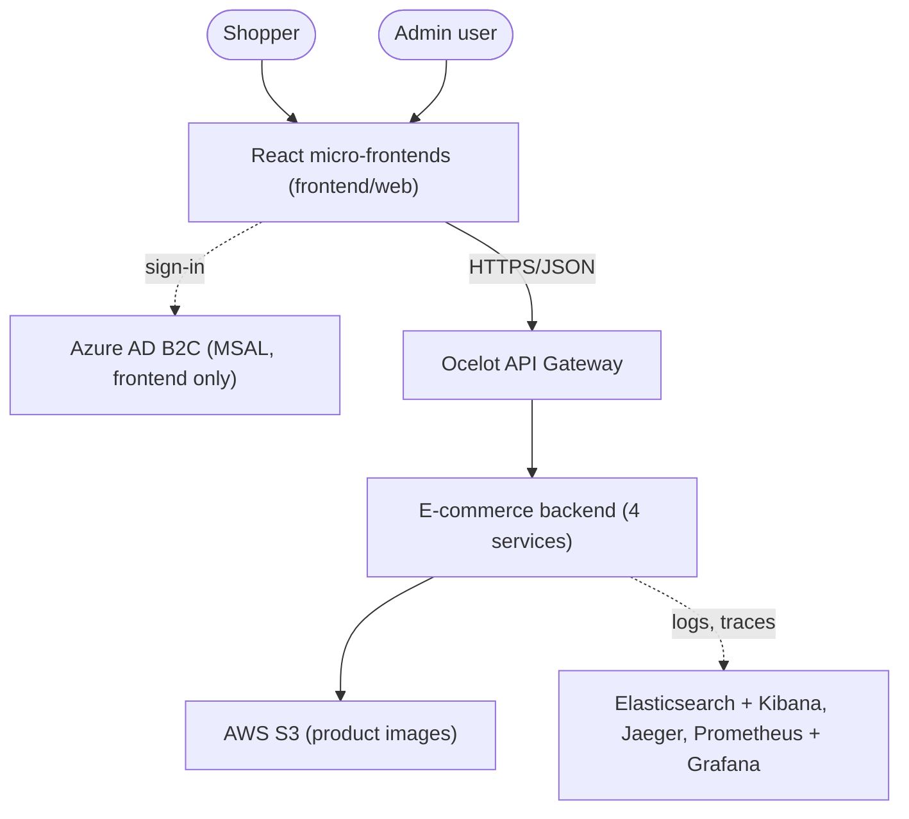
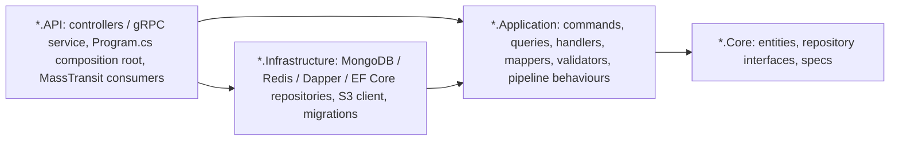
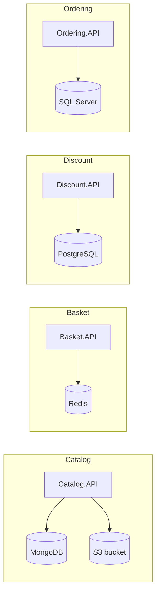
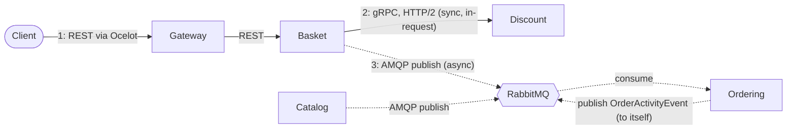

import { Aside } from '@astrojs/starlight/components';
import Src from '../../components/Src.astro';

The platform follows a conventional microservices layout. It has one edge gateway, four business services that each own their data, a message broker for cross-service events, and a set of shared building blocks packaged as class libraries. Everything lives in a single repository and a single solution, <Src path="Ecommerce.sln" />, but each service builds into its own container image and deploys independently.

## System context

The browser application signs users in against Azure AD B2C through MSAL (<Src path="frontend/web/host/src/auth/msal/config.ts" />). **The backend does not validate those tokens.** No service calls `AddAuthentication`, and no controller carries `[Authorize]`. Every API and the gateway also use an allow-any-origin CORS policy. JWT validation at the gateway and in the services is on the [roadmap](/roadmap/).

## Solution layout

| Folder | Contents |
|---|---|
| <Src path="src/Services" tree /> | `Catalog`, `Basket`, `Discount`, `Ordering`, each split into `*.API`, `*.Application`, `*.Core` and `*.Infrastructure` projects |
| <Src path="src/ApiGateways/Ocelot.ApiGateway" tree /> | The Ocelot gateway, with one route file per environment |
| <Src path="src/BuildingBlocks" tree /> | `Common.Mediator` (CQRS dispatcher), `Common.Logging` (Serilog setup), `EventBus.Messages` (integration event contracts) |
| <Src path="deploy" tree /> | Kubernetes manifests, Helm charts, Istio, Grafana dashboards, Terraform, CloudFormation |
| <Src path="frontend" tree /> | `web/` (React micro-frontends, current) and `legacy-angular/` (deprecated SPA) |
| <Src path="tests/load/k6" tree /> | k6 load-test scripts |

NuGet versions are centrally managed in <Src path="Directory.Packages.props" />, so no `.csproj` states a version.

## Clean Architecture inside each service

Every service uses the same four-project split. Dependencies point inward, and the `Core` project knows nothing about ASP.NET, MongoDB, EF Core or RabbitMQ.

The dependency direction is enforced only by project references. There are no architecture tests. Some leaks are visible in the code:

- `Catalog.Core` references `MongoDB.Driver` because entities carry `[BsonId]` attributes (<Src path="src/Services/Catalog/Catalog.Core/Entities/BaseEntity.cs" />).
- `Catalog.Application` command and response DTOs also carry BSON attributes.
- `Discount.Application` returns the protobuf-generated `CouponModel` from its handlers, so the gRPC contract is part of the application layer (<Src path="src/Services/Discount/Discount.Application/Handlers/GetDiscountQueryHandler.cs" />).

These are pragmatic shortcuts, and they are called out on each service page.

## Service boundaries and data ownership

Each service owns exactly one datastore, chosen for its access pattern. No service reads another service's database. Data that crosses a boundary moves either inside a request (Basket asks Discount for a coupon) or inside an event (Basket hands checkout data to Ordering).

| Service | Responsibility | Store | Why this store | Access code |
|---|---|---|---|---|
| [Catalog](/services/catalog/) | Products, brands, types, product images | MongoDB (`Products`, `Brands`, `Types` collections) and S3 | Document model with embedded brand and type; flexible schema for product data | MongoDB.Driver, AWSSDK.S3 |
| [Basket](/services/basket/) | Per-user shopping cart; checkout trigger | Redis (key = user name, value = JSON cart) | Ephemeral, key-value, read and written on every cart change | `IDistributedCache` (StackExchange.Redis) |
| [Discount](/services/discount/) | Product coupons | PostgreSQL (`Coupon` table) | Small relational table; simple SQL | Npgsql + Dapper |
| [Ordering](/services/ordering/) | Orders and an activity feed | SQL Server (`Orders`, `Activities` tables) | Transactional records, EF Core migrations | EF Core 10 (SqlServer provider) |

### What crosses a boundary

- **Product identity and price** are copied into the cart. `ShoppingCartItem` stores `ProductId`, `ProductName`, `ImageFile` and `Price` as sent by the client (<Src path="src/Services/Basket/Basket.Core/Entities/ShoppingCartItem.cs" />). Basket does not re-read Catalog, so the price is whatever the client submitted.
- **Discounts are keyed by product name**, not ID. Basket sends `ProductName` over gRPC, and Discount looks up `Coupon.ProductName` (<Src path="src/Services/Discount/Discount.Infrastructure/Repositories/DiscountRepository.cs" />). Renaming a product in Catalog silently detaches its coupon.
- **Orders are denormalised snapshots.** `Order` holds the user name, total price, address and payment fields from the checkout event, with no line items (<Src path="src/Services/Ordering/Ordering.Core/Entities/Order.cs" />).

## Communication

The system uses three styles, each chosen for a reason.

### 1. REST through the gateway (north-south)

All client traffic enters through Ocelot, which maps friendly upstream paths such as `/Catalog/GetAllProducts` to versioned downstream routes such as `/api/v1/Catalog/GetAllProducts`. The gateway adds response caching on a few read routes and rate-limits checkout. See [API Gateway](/api-gateway/).

Controllers use URL-segment API versioning (`api/v{version:apiVersion}/[controller]`, with `Asp.Versioning.Mvc`). Basket is the only service with a second version: `api/v2/Basket/Checkout` publishes a slimmer `BasketCheckoutEventV2`.

### 2. gRPC between Basket and Discount (east-west, synchronous)

When a cart is saved, Basket calls `DiscountProtoService.GetDiscount` for each item that does not have a discount yet. The contract is a single `.proto` file owned by Discount (<Src path="src/Services/Discount/Discount.Application/Protos/discount.proto" />). Basket compiles it with `GrpcServices="Client"`, and Discount compiles it with `GrpcServices="Server"`. gRPC fits here because the call is on the request path, internal only, and benefits from a typed, compact contract.

Basket degrades gracefully. `DiscountGrpcService` catches `RpcException` and returns a zero-amount coupon, so an unavailable Discount service does not break adding to the cart (<Src path="src/Services/Basket/Basket.Application/GrpcService/DiscountGrpcService.cs" />).

### 3. Integration events over RabbitMQ (asynchronous)

Checkout crosses from Basket to Ordering as an event. Nothing calls Ordering directly, so Basket stays available when Ordering is down, and messages queue in RabbitMQ until Ordering consumes them. MassTransit handles serialization, exchange and queue topology, and consumer dispatch.

| Event | Publisher | Queue (receive endpoint) | Consumer |
|---|---|---|---|
| `BasketCheckoutEvent` | Basket v1 `Checkout` | `basketcheckout-queue` | `BasketOrderingConsumer` → `CheckoutOrderCommand` |
| `BasketCheckoutEventV2` | Basket v2 `Checkout` | `basketcheckout-queue-v2` | `BasketOrderingConsumerV2` → `CheckoutOrderCommandV2` |
| `ProductActivityEvent` | Catalog `CreateProduct`, `UpdateProduct` | `product-activity-queue` | `ProductActivityConsumer` → `Activities` row |
| `OrderActivityEvent` | Ordering (after an order is created) | `order-activity-queue` | `OrderActivityConsumer` → `Activities` row |

Contracts and queue names live in <Src path="src/BuildingBlocks/EventBus.Messages" tree />. The consumers and endpoint wiring are in <Src path="src/Services/Ordering/Ordering.API/Program.cs" />. See [Event bus](/building-blocks/event-bus/) for details.

<Aside type="caution" title="Delivery guarantees">
Events are published straight from controllers with `IPublishEndpoint.Publish`, after the database write and outside any transaction. There is no transactional outbox, so a crash between the write and the publish loses the event. At checkout, Basket publishes and then deletes the cart in two separate steps. The activity consumers are idempotent (they check `EventId`), but the checkout consumer is not, so a redelivered checkout event creates a duplicate order. The outbox pattern is on the [roadmap](/roadmap/).
</Aside>

## Cross-cutting concerns

| Concern | How it is handled | Status |
|---|---|---|
| Logging | Serilog with console and Elasticsearch sinks, configured once in `Common.Logging` | implemented |
| Tracing | OpenTelemetry ASP.NET Core instrumentation (plus gRPC client in Basket), OTLP to Jaeger | partial: no MassTransit or DB spans |
| Metrics | Istio sidecar metrics scraped by Prometheus; no app-level metrics | mesh only |
| Validation | FluentValidation through a mediator pipeline behaviour, Ordering only | Ordering only |
| Resilience | Polly retry for Ordering's startup migration, EF Core `EnableRetryOnFailure`, Discount migration retry loop, gRPC fallback in Basket | partial |
| Authentication and authorization | None on the backend; MSAL in the frontend | planned |
| Health checks | Packages referenced (`AspNetCore.HealthChecks.*`) but no endpoints are mapped | planned |
| Error handling | Developer exception page in Development; no ProblemDetails mapping | gap |
