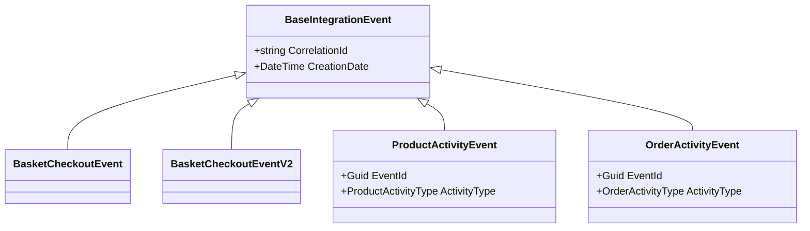
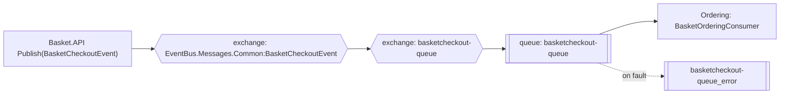

import { Aside } from '@astrojs/starlight/components';
import Src from '../../../components/Src.astro';

`EventBus.Messages` is a dependency-free class library holding the contracts that cross service boundaries over RabbitMQ. Publishers and consumers reference the same assembly, so the message types are identical on both sides.

## Contracts

| Type | File | Payload |
|---|---|---|
| `BaseIntegrationEvent` | <Src path="src/BuildingBlocks/EventBus.Messages/Events/BaseIntegrationEvent.cs" /> | `CorrelationId` (new GUID string), `CreationDate` (UTC) |
| `BasketCheckoutEvent` | <Src path="src/BuildingBlocks/EventBus.Messages/Events/BasketCheckoutEvent.cs" /> | User name, total, name, email, address, card name, number, expiry, CVV, payment method |
| `BasketCheckoutEventV2` | <Src path="src/BuildingBlocks/EventBus.Messages/Events/BasketCheckoutEventV2.cs" /> | User name, total |
| `ProductActivityEvent` | <Src path="src/BuildingBlocks/EventBus.Messages/Events/ProductActivityEvent.cs" /> | `EventId` (idempotency key), `ActivityType` (Created, Updated, Deleted), product ID and name, actor, `OccurredAt`, metadata |
| `OrderActivityEvent` | <Src path="src/BuildingBlocks/EventBus.Messages/Events/OrderActivityEvent.cs" /> | `EventId`, `ActivityType` (Created, Updated, Cancelled), order ID, actor, total, `OccurredAt`, metadata |

Queue names are constants in <Src path="src/BuildingBlocks/EventBus.Messages/Common/EventBusConstant.cs" />: `basketcheckout-queue`, `basketcheckout-queue-v2`, `product-activity-queue`, `order-activity-queue`.



## How MassTransit wires it to RabbitMQ

Publishers call `IPublishEndpoint.Publish(message)`. MassTransit publishes to a **fanout exchange named after the message type**, for example `EventBus.Messages.Common:BasketCheckoutEvent`. It does not publish to a queue directly.

On the consumer side, Ordering declares named receive endpoints (<Src path="src/Services/Ordering/Ordering.API/Program.cs" />):

```csharp
cfg.ReceiveEndpoint(EventBusConstant.BasketCheckoutQueue,
    c => c.ConfigureConsumer<BasketOrderingConsumer>(ctx));
```

For each endpoint, MassTransit creates the queue, an exchange with the same name, and a binding from each consumed message-type exchange to it. Any number of services could add their own queue for `BasketCheckoutEvent` and each would get a copy, which is pub/sub rather than point-to-point.



## Versioning by new type

The v2 checkout sends a **new message type** (`BasketCheckoutEventV2`) with its own queue and consumer, instead of changing v1. Old and new publishers can run side by side during a rollout, and neither consumer has to handle two shapes. The trade-off is duplicated consumer and handler code.

## Delivery semantics

| Aspect | Current behaviour |
|---|---|
| Publish reliability | Fire-and-forget after the DB write; **no outbox**, so an event can be lost if the process crashes between the two steps |
| Consumer retries | None configured (`UseMessageRetry` is not set); faults go straight to `<queue>_error` |
| Idempotency | Activity consumers check `EventId` against a unique index. The checkout consumer has no dedupe, so a redelivery creates a second order |
| Ordering | Not guaranteed, and no consumer depends on order |
| Correlation | `CorrelationId` is set in the base class, but it is not tied to the OpenTelemetry trace |

<Aside type="tip" title="Planned">
MassTransit ships an EF Core transactional outbox and inbox (`AddEntityFrameworkOutbox`). Adding it to Ordering, plus a lightweight outbox for Basket (for example, Redis with a relay, or moving checkout state to a relational store), would give at-least-once publishing with de-duplicated consumption. See the [roadmap](/roadmap/).
</Aside>

Also note that `ProductActivityType.Deleted` exists, but Catalog's delete endpoint does not publish it.
