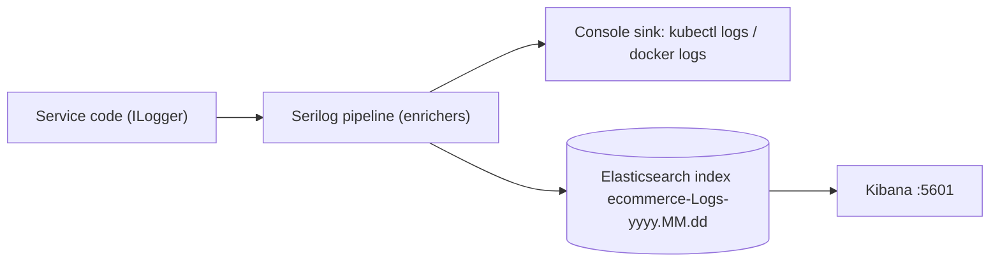

import { Aside } from '@astrojs/starlight/components';
import Src from '../../../components/Src.astro';

Logging is configured once, in a shared library, and every service opts in with one line:

```csharp
builder.Host.UseSerilog(Logging.ConfigureLogger);
```

## What `ConfigureLogger` does

<Src path="src/BuildingBlocks/Common.Logging/Logging.cs" /> exposes a static `Action<HostBuilderContext, LoggerConfiguration>`:

| Setting | Value |
|---|---|
| Minimum level | `Information` |
| Overrides | `Microsoft.AspNetCore` and `Microsoft.Hosting.Lifetime` at `Warning` |
| Development overrides | `Catalog`, `Basket`, `Discount`, `Ordering` namespaces at `Debug` |
| Enrichers | `FromLogContext`, `ApplicationName`, `EnvironmentName`, `WithExceptionDetails` (Serilog.Exceptions) |
| Sinks | Console always; Elasticsearch when `ElasticConfiguration:Uri` is set |
| Elasticsearch options | `AutoRegisterTemplate`, template version `ESv8`, index `ecommerce-Logs-{yyyy.MM.dd}`, min level `Debug` |

Because `Enrich.FromLogContext()` is on, logging scopes flow into every event. `BasketOrderingConsumer` opens a scope with the message's `CorrelationId`, so every log line written while handling a checkout carries it, and you can search Kibana for a single checkout.

Handlers mostly use structured message templates (`"Deleting image from S3: Bucket={Bucket}, Key={Key}"`), which Elasticsearch indexes as fields. A few older call sites use string interpolation (`$"Order with Id {generatedOrder.Id} ..."`), which loses the structure. Those are worth converting.



<Aside type="note" title="Version note">
The sink is configured with `AutoRegisterTemplateVersion.ESv8`, but the Compose file and the Kubernetes manifests run Elasticsearch **7.9.2**. On AWS, Terraform provisions **OpenSearch 2.11**. The sink package (`Serilog.Sinks.Elasticsearch` 9.0.3) is also deprecated upstream in favour of `Elastic.Serilog.Sinks`. Aligning these versions is on the roadmap.
</Aside>

## Tracing (per service, not in the shared library)

Tracing is **not** in `Common.Logging`. Each `Program.cs` repeats the same block:

```csharp
builder.Services.AddOpenTelemetry()
    .WithTracing(t => t
        .AddSource("Catalog.API")
        .SetResourceBuilder(ResourceBuilder.CreateDefault().AddService("Catalog.API"))
        .AddAspNetCoreInstrumentation()
        .AddOtlpExporter(o => o.Endpoint = new Uri(
            builder.Configuration["Otlp:Endpoint"] ?? "http://jaeger-collector.istio-system:4317")));
```

| Service | Instrumentation |
|---|---|
| Catalog | ASP.NET Core |
| Basket | ASP.NET Core + gRPC client (`AddGrpcClientInstrumentation`) |
| Discount | ASP.NET Core (covers incoming gRPC) |
| Ordering | ASP.NET Core |

Consequences:

- An add-to-cart request shows the Basket server span, the gRPC client span and the Discount server span in one trace, because W3C `traceparent` propagates over HTTP/2.
- MassTransit's `ActivitySource` is not added, so a checkout trace **stops at the publish**. The Ordering consumer starts a separate, unlinked trace.
- There are no spans for MongoDB, Redis, Npgsql or EF Core.
- The default endpoint assumes the Jaeger collector in the `istio-system` namespace. In Docker Compose, where no Jaeger runs, the exporter fails quietly in the background.

Moving this block into a shared `AddPlatformTelemetry()` extension, adding `MassTransit` and EF Core instrumentation, and adding OTel metrics would close these gaps. See [Observability](/observability/) for the mesh-level view Istio adds.
