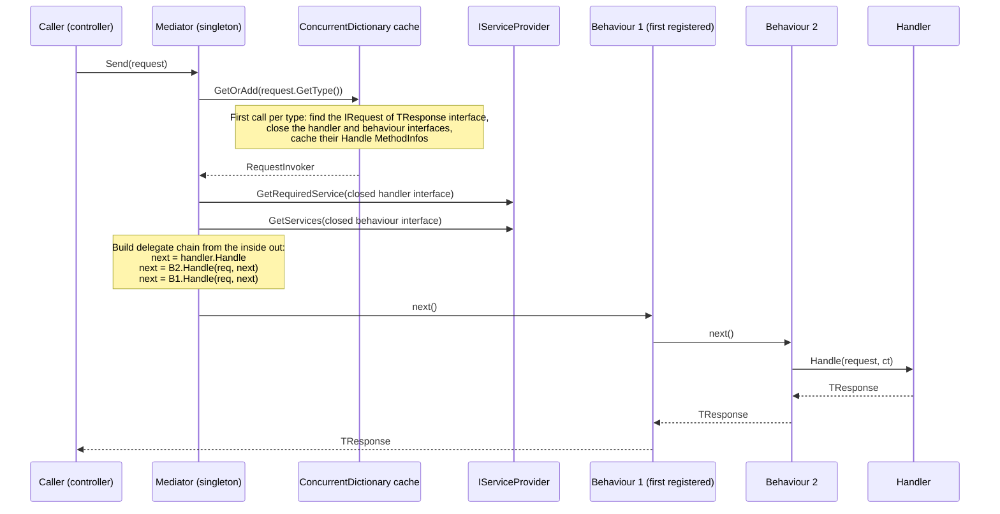

import { Aside } from '@astrojs/starlight/components';
import Src from '../../../components/Src.astro';

Every controller, gRPC service and message consumer in the platform dispatches work through `IMediator.Send(...)`. Until recently that was MediatR. It is now a small in-house library, **Common.Mediator**, of about 150 lines in three files. It keeps MediatR's call shape, so the switch touched only `using` statements and registration code.

| File | Role |
|---|---|
| <Src path="src/BuildingBlocks/Common.Mediator/Abstractions.cs" /> | `IRequest<T>`, `IRequest`, `Unit`, `IRequestHandler<TReq,TRes>`, `IPipelineBehavior<TReq,TRes>`, `RequestHandlerDelegate<T>`, `IMediator` |
| <Src path="src/BuildingBlocks/Common.Mediator/ServiceCollectionExtensions.cs" /> | `AddMediator(params Assembly[])`: registration and handler discovery |
| <Src path="src/BuildingBlocks/Common.Mediator/Mediator.cs" /> | The dispatcher: reflection, caching, pipeline composition |

The only package dependency is `Microsoft.Extensions.DependencyInjection.Abstractions`.

## Why write one

The commit that introduced it explains the choice. MediatR 13 and later are commercially licensed, and the repository was pinned to 12.5.0, the last free version, which receives no further fixes. The platform used only a small slice of MediatR: request/response dispatch and pipeline behaviours, with no notifications, streams or pre/post-processors. A focused implementation removes the dependency and keeps the programming model. The migration changed 64 files from `using MediatR;` to `using Common.Mediator;` and replaced 4 `AddMediatR(...)` calls, and it left the existing behaviours unchanged. AutoMapper was replaced by Mapperly in the same modernization, which gives source-generated mapping with no runtime reflection.

## The abstractions

```csharp
public interface IRequest<out TResponse> { }
public interface IRequest : IRequest<Unit> { }          // "void" requests

public interface IRequestHandler<in TRequest, TResponse>
    where TRequest : IRequest<TResponse>
{
    Task<TResponse> Handle(TRequest request, CancellationToken cancellationToken);
}

public delegate Task<TResponse> RequestHandlerDelegate<TResponse>();

public interface IPipelineBehavior<in TRequest, TResponse> where TRequest : notnull
{
    Task<TResponse> Handle(TRequest request, RequestHandlerDelegate<TResponse> next,
                           CancellationToken cancellationToken);
}

public interface IMediator
{
    Task<TResponse> Send<TResponse>(IRequest<TResponse> request,
                                    CancellationToken cancellationToken = default);
}
```

`Unit` is a readonly struct where every value is equal, with a cached `Unit.Task`, mirroring MediatR for source compatibility.

Commands and queries are just request types. The split between them is a naming and folder convention (`Commands/`, `Queries/`, `Handlers/` in each `*.Application` project), not something the library enforces. Reads and writes share the same store in every service. This is CQRS at the code-organisation level, with no separate read model.

## Registration

```csharp
builder.Services.AddMediator(Assembly.GetExecutingAssembly(), typeof(GetAllBrandsHandler).Assembly);
```

`AddMediator`:

1. Registers `IMediator → Mediator` as a **singleton**.
2. Scans each distinct assembly for concrete types that implement a closed `IRequestHandler<,>`, and registers each interface as **transient**.

It does **not** discover pipeline behaviours. Services register those themselves as open generics, and only Ordering does (<Src path="src/Services/Ordering/Ordering.Application/Extensions/ServiceRegistration.cs" />).

## Dispatch, step by step



In code (<Src path="src/BuildingBlocks/Common.Mediator/Mediator.cs" />):

- **Type resolution is cached per request type.** `RequestInvoker.Build` finds the `IRequest<TResponse>` interface on the runtime type, closes the generic handler and behaviour interfaces over `(TRequest, TResponse)`, and looks up their `Handle` `MethodInfo`s once. A static `ConcurrentDictionary<Type, RequestInvoker>` stores the result, so later calls skip the interface scan.
- **The pipeline is composed on every call.** The innermost delegate invokes the handler. The loop then walks the behaviour array **from last to first**, wrapping `next` each time. The first-registered behaviour therefore ends up outermost and runs first, the same ordering MediatR uses.
- **Invocation uses `MethodInfo.Invoke`.** The cast to `Task<TResponse>` works because handlers return exactly that type. Reflection invocation costs more than a compiled delegate, but it is negligible next to the database I/O every handler performs.

## What the pipeline gives you

A behaviour sees every request of every type. Ordering uses that for cross-cutting policy:

```csharp
public async Task<TResponse> Handle(TRequest request, RequestHandlerDelegate<TResponse> next, CancellationToken ct)
{
    if (_validators.Any())
    {
        var context = new ValidationContext<TRequest>(request);
        var results = await Task.WhenAll(_validators.Select(v => v.ValidateAsync(context, ct)));
        var failures = results.SelectMany(r => r.Errors).Where(f => f != null).ToList();
        if (failures.Count != 0) throw new ValidationException(failures);
    }
    return await next();
}
```

Adding logging, timing, caching or authorization for every command would be one more open-generic registration.

## Lifetime: resolved from the caller's scope

`AddMediator` registers `IMediator` as **scoped** (`TryAddScoped<IMediator, Mediator>()` in <Src path="src/BuildingBlocks/Common.Mediator/ServiceCollectionExtensions.cs" />), so each HTTP request or MassTransit consume scope gets a mediator bound to its own `IServiceProvider`. Handlers and their scoped dependencies (repositories, the Mongo context, EF Core's `OrderContext`) are therefore resolved per request.

<Aside type="note" title="Fixed in #564">
Until [#564](https://github.com/sloweyyy/cloud-native-ecommerce-platform/pull/564) the mediator was a **singleton** holding the root provider. Under Development scope validation every dispatch threw `Cannot resolve ... from root provider because it requires scoped service`, so every API call returned 500. Outside Development, scoped services silently became process-wide singletons, including one shared `DbContext`. A regression test in <Src path="tests/unit/Common.Mediator.Tests" tree /> now builds a provider with `ValidateScopes = true` and asserts that each scope gets its own instances.
</Aside>

## Differences from MediatR

| Feature | MediatR | Common.Mediator |
|---|---|---|
| `Send` request/response | yes | yes |
| Pipeline behaviours | yes | yes (manual registration) |
| Notifications (`Publish`) | yes | no. Integration events go through MassTransit instead |
| Streams, pre/post processors, exception handlers | yes | no |
| Handler lookup | compiled wrappers | cached `MethodInfo` + reflection invoke |
| `IMediator` lifetime | transient | scoped (see above) |
