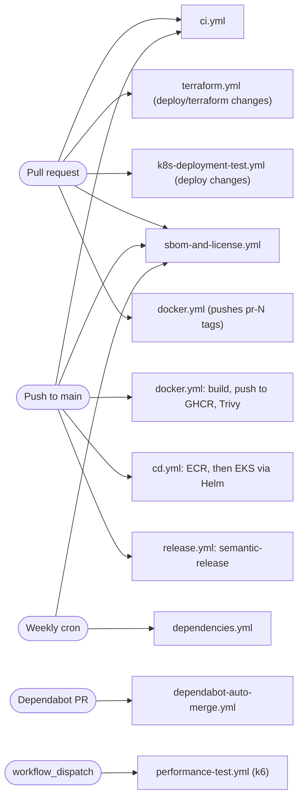
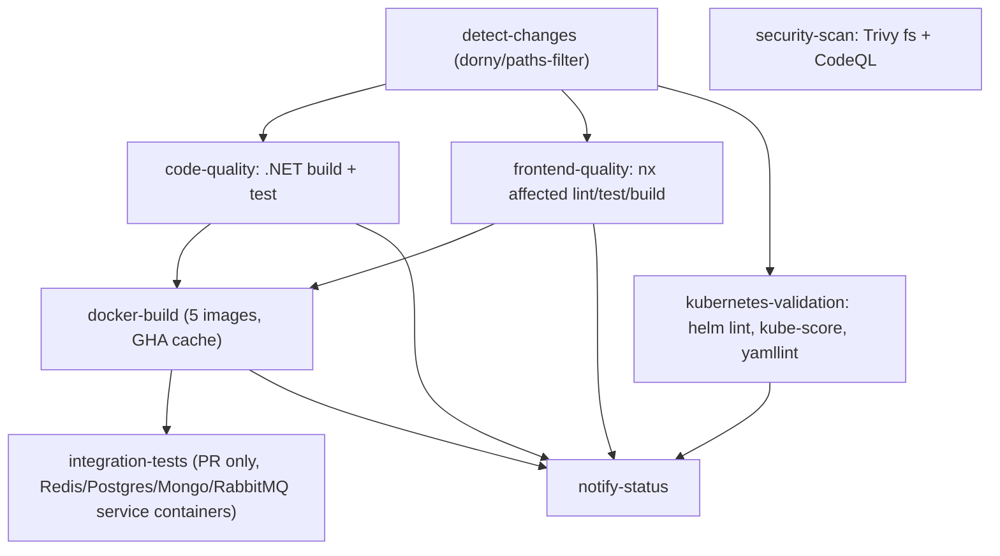

import { Aside } from '@astrojs/starlight/components';
import Src from '../../components/Src.astro';

All automation lives in <Src path=".github/workflows" tree />. Third-party actions are referenced by major version tag, and Dependabot keeps them current.

## Pipeline overview

## Workflows

| Workflow | Trigger | What it does |
|---|---|---|
| <Src path=".github/workflows/ci.yml" /> | push and PR to `main`/`develop` | Path filter decides which jobs run. Backend: `dotnet restore/build/test` with coverage summary. Security: Trivy filesystem scan (SARIF uploaded) and **CodeQL** for C# and JavaScript. Frontend: `npm ci` then `nx affected` lint, test and build in `frontend/web`. Docker build matrix for the 5 images. Helm lint, kube-score and a manifest validation script for `deploy/**`. PR status comment. |
| <Src path=".github/workflows/docker.yml" /> | push to `main`/`develop`, tags `v*`, PR to `main` | Buildx matrix for 5 images (`linux/amd64`; arm64 was dropped because `protoc` segfaults under QEMU). Pushes to **GHCR**, including on PRs, (`ghcr.io/<repo>/<service>`) with branch, PR, semver, `main-<sha>` and `latest` tags. Then Trivy scans each pushed image and uploads SARIF to the Security tab. |
| <Src path=".github/workflows/cd.yml" /> | push to `main`, tags `v*`, manual (choose env and region) | Assumes an AWS role over **OIDC**, builds `linux/amd64` images, pushes to **ECR** (creating repos with scan-on-push), Trivy-scans them, then deploys DB, service and gateway charts to EKS with Helm, runs the S3 URL migration and a smoke check. |
| <Src path=".github/workflows/terraform.yml" /> | PR or push touching `deploy/terraform/**` | `terraform fmt -check`, `init -backend=false` + `validate`, TFLint, Trivy IaC scan (non-blocking), and on PRs `plan` posted as a comment. |
| <Src path=".github/workflows/k8s-deployment-test.yml" /> | PR touching deploy paths, manual | Starts Minikube, builds the 5 images and loads them, runs `deploy/k8s/deploy-all.sh`, waits for pods, checks service connectivity and endpoints, collects logs on failure, and comments a report. |
| <Src path=".github/workflows/sbom-and-license.yml" /> | push and PR to `main`, weekly | Builds each image, generates an **SPDX SBOM with Syft** (`anchore/sbom-action`), scans it with **Grype** (`anchore/scan-action`, cutoff `high`, non-blocking). License report for NuGet and npm, with `license-checker --failOn "GPL-3.0;AGPL-3.0"`. |
| <Src path=".github/workflows/release.yml" /> | push to `main`, manual | Runs **semantic-release** (Angular commit convention, <Src path=".releaserc.json" />). When a version is due: creates the tag and GitHub release, opens a CHANGELOG PR, notifies Slack and opens an announcement issue. |
| <Src path=".github/workflows/dependabot-auto-merge.yml" /> | `pull_request_target` from bots | Approves and enables squash auto-merge for Dependabot **patch/minor** bumps; comments on majors; auto-merges `github-actions[bot]` PRs that only change `CHANGELOG.md`. |
| <Src path=".github/workflows/dependencies.yml" /> | Mondays 06:00 UTC, manual | `dotnet list package --vulnerable --include-transitive` and `npm audit` in `frontend/web`. Informational. |
| <Src path=".github/workflows/performance-test.yml" /> | manual only | Builds and starts Catalog, Basket, Ordering and the gateway on the runner, then runs a k6 script chosen by `test_type` (`smoke`, `stress`, `spike`, `soak`) and uploads results. |

## CI in detail

Path filtering keeps PRs fast. A frontend-only change skips the .NET build, and a docs change skips almost everything. The docker-build job tolerates a skipped upstream job (`result == 'skipped'`) so it still runs on backend-only or frontend-only PRs.

## Dependabot policy

<Src path=".github/dependabot.yml" /> covers five ecosystems every Monday at 06:00. The rationale is written up in <Src path="docs/dependency-management.md" />.

| Ecosystem | Directory | Grouping | Ignored |
|---|---|---|---|
| NuGet | `/` (central `Directory.Packages.props`) | `dotnet-minor-and-patch` | semver-major |
| npm | `/frontend/web` | `minor-and-patch` | `nx`, `@nx/*`, `@nrwl/*`, semver-major |
| npm | `/frontend/legacy-angular` | `minor-and-patch` | `nx`, `@nx/*`, `@nrwl/*`, semver-major |
| Docker | `/src/Services/*/*.API`, `/src/ApiGateways/*` | `docker-images` | |
| GitHub Actions | `/` | `github-actions` | |

Two decisions stand out:

- **Nx is excluded.** Nx core and every `@nx/*` plugin must move together through `nx migrate`. Piecemeal Dependabot bumps previously left the toolchain split across versions and produced a lockfile that `npm ci` rejected, which broke `frontend-quality` repeatedly. Nx upgrades are now a deliberate, manual migration (the most recent aligned everything on 23.2.1).
- **Grouping plus auto-merge.** Non-major updates arrive as one PR per ecosystem and merge automatically once CI is green. Majors wait for a human. This keeps weekly dependency hygiene to a few minutes of review.

## Security scanning

| Tool | Scope | Where results go | Blocking? |
|---|---|---|---|
| Trivy (fs) | Repository files and lockfiles, CRITICAL/HIGH | GitHub Security tab (SARIF) | no |
| Trivy (image) | Every pushed GHCR and ECR image | Security tab (GHCR) | no |
| Trivy (config) | Terraform | job log | no (`exit-code: 0`) |
| CodeQL | C# and JavaScript | Security tab | no |
| Syft + Grype | SBOM per image (SPDX JSON, uploaded as an artifact) | job log, artifact | no (`fail-build: false`) |
| ECR scan-on-push | Images in ECR | AWS console | no |
| License checker | npm production deps | step summary | fails only on GPL-3.0/AGPL-3.0 |

<Aside type="caution" title="Honest assessment">
The pipeline is broad but mostly **advisory**:

- There are **no backend test projects**, so `dotnet test` succeeds without running anything. The integration-test job filters on `Category=Integration`, ends with `|| true`, and has `continue-on-error: true`.
- The CD smoke test exits 0 when the load balancer is not ready, and `curl ... || echo`, so it cannot fail a deploy.
- CD deploys `latest` on every push to `main`, with no approval gate between environments.
- Security scans report but never block. Choosing which findings block (for example, CRITICAL with a fix available) is a natural next step.
</Aside>
