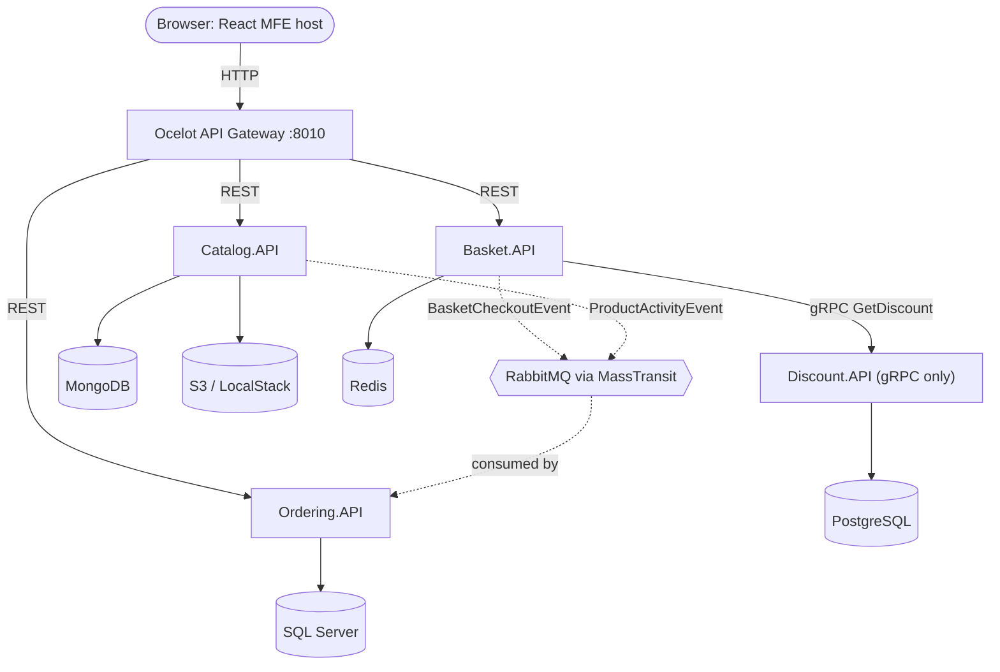

import { Card, CardGrid, LinkCard, Aside } from '@astrojs/starlight/components';
import Src from '../../components/Src.astro';

<div class="stat-strip">
  <div><strong>4</strong><span>microservices (.NET 10)</span></div>
  <div><strong>4</strong><span>database engines, one per service</span></div>
  <div><strong>3</strong><span>communication styles: REST, gRPC, AMQP</span></div>
  <div><strong>15</strong><span>Helm charts</span></div>
  <div><strong>8</strong><span>Terraform modules on AWS</span></div>
  <div><strong>10</strong><span>GitHub Actions workflows</span></div>
</div>

## What this project is

This is a portfolio-scale e-commerce backend built as a set of independently deployable services. A shopper browses a product **catalog**, adds items to a **basket** (discounts are applied on the way in), and checks out. Checkout emits an integration event that the **ordering** service turns into a persisted order. The **discount** service owns coupons and is reached only over gRPC.

The repository contains more than application code. It also includes the delivery infrastructure: Dockerfiles and a Compose stack for local development, raw Kubernetes manifests and Helm charts, an Istio service mesh with Jaeger and Kiali, Terraform modules and CloudFormation templates for AWS (VPC, EKS, ECR and managed data stores), and GitHub Actions pipelines for CI, image publishing, SBOM generation, Terraform checks and deployment to EKS.

The frontend is a React 18 micro-frontend application built with Nx and Webpack Module Federation, found in <Src path="frontend/web" tree />. It is covered in its own [section](/micro-frontends/).

## Architecture at a glance



All four services also send structured logs to Elasticsearch through the shared Serilog configuration, and traces to Jaeger over OTLP.

The [architecture page](/architecture/) covers service boundaries, data ownership, and when the system uses synchronous or asynchronous communication. [Request flows](/request-flows/) walks through the three main user journeys with sequence diagrams.

## Tech stack

| Concern | Technology (version pinned in the repo) | Where |
|---|---|---|
| Runtime | .NET SDK 10.0.300, `net10.0` target | <Src path="global.json" /> |
| Web APIs | ASP.NET Core controllers, `Asp.Versioning.Mvc` 10.2, Swashbuckle 6.9 | <Src path="Directory.Packages.props" /> |
| CQRS / dispatch | In-house `Common.Mediator` (replaced MediatR) | <Src path="src/BuildingBlocks/Common.Mediator" tree /> |
| Mapping | Riok.Mapperly 4.3 (source-generated, replaced AutoMapper) | per-service `Mappers/` folders |
| Validation | FluentValidation 11.12 (Ordering) | <Src path="src/Services/Ordering/Ordering.Application/Validators" tree /> |
| Messaging | MassTransit 8.5 on RabbitMQ 3 | <Src path="src/BuildingBlocks/EventBus.Messages" tree /> |
| Sync RPC | gRPC (`Grpc.AspNetCore` 2.83), protobuf contract | <Src path="src/Services/Discount/Discount.Application/Protos/discount.proto" /> |
| Gateway | Ocelot 23.4 | <Src path="src/ApiGateways/Ocelot.ApiGateway" tree /> |
| Data | MongoDB.Driver 3.12, StackExchange.Redis cache, Npgsql 10 + Dapper, EF Core 10 (SQL Server) | service `Infrastructure` projects |
| Object storage | AWSSDK.S3, with LocalStack for local development | <Src path="src/Services/Catalog/Catalog.Infrastructure/Services/S3ImageStorageService.cs" /> |
| Logging | Serilog 8 with Console and Elasticsearch sinks | <Src path="src/BuildingBlocks/Common.Logging/Logging.cs" /> |
| Tracing | OpenTelemetry 1.19, OTLP exporter to Jaeger | each service's `Program.cs` |
| Containers | Multi-stage Dockerfiles, Docker Compose | <Src path="docker-compose.yml" /> |
| Orchestration | Kubernetes manifests, 15 Helm charts, HPA, PDBs, NetworkPolicies | <Src path="deploy" tree /> |
| Service mesh | Istio (sidecars, ingress gateway, telemetry), Jaeger, Kiali | <Src path="deploy/istio" tree /> |
| Cloud | Terraform (AWS provider ~> 5.80) and CloudFormation | <Src path="deploy/terraform" tree />, <Src path="deploy/aws/cloudformation" tree /> |
| CI/CD | GitHub Actions, Trivy, CodeQL, Syft/Grype SBOM, semantic-release, Dependabot | <Src path=".github/workflows" tree /> |
| Load testing | k6 (smoke, load, stress, spike, soak, workflow scripts) | <Src path="tests/load/k6" tree /> |
| Frontend | React 18, Nx 23.2.1, Module Federation, TanStack Router/Query, Ant Design, MSAL | <Src path="frontend/web" tree /> |

## Quick start

```bash
git clone https://github.com/sloweyyy/cloud-native-ecommerce-platform.git
cd cloud-native-ecommerce-platform
cp .env.example .env                 # connection strings and credentials for local containers
docker compose up -d --build         # 4 APIs, gateway, 4 databases, RabbitMQ, ES/Kibana, LocalStack
curl http://localhost:8010/Catalog/GetAllProducts   # through the Ocelot gateway
```

See [Getting started](/getting-started/) for ports, what each container does, and troubleshooting.

<Aside type="caution" title="Read the known gaps">
This is a learning and portfolio project, not a production system. Several things you might expect are **not implemented yet**: authentication on the APIs (JWT is planned), health-check endpoints, a transactional outbox, and backend unit or integration tests. The [Known gaps](/known-gaps/) page lists each one with the file that shows it.
</Aside>

## Explore

<CardGrid>
  <LinkCard title="Architecture" href="/architecture/" description="System context, service boundaries, database-per-service, sync vs async communication." />
  <LinkCard title="Services" href="/services/catalog/" description="Catalog, Basket, Discount and Ordering: layers, endpoints, data models, implementation notes." />
  <LinkCard title="Building blocks" href="/building-blocks/mediator/" description="The in-house mediator with pipeline behaviours, shared logging, and integration events." />
  <LinkCard title="Request flows" href="/request-flows/" description="Sequence diagrams for browsing, add-to-cart with a gRPC discount lookup, and checkout." />
  <LinkCard title="Infrastructure" href="/infrastructure/docker-compose/" description="Compose, Kubernetes and Helm, Istio, Terraform and CloudFormation on AWS." />
  <LinkCard title="CI/CD & supply chain" href="/ci-cd/" description="Every workflow, Dependabot policy, Trivy, CodeQL and SBOMs." />
  <LinkCard title="Observability" href="/observability/" description="Logs in Elasticsearch/Kibana, metrics in Prometheus/Grafana, traces in Jaeger." />
  <LinkCard title="Roadmap" href="/roadmap/" description="Recent engineering work and what is planned next." />
</CardGrid>
