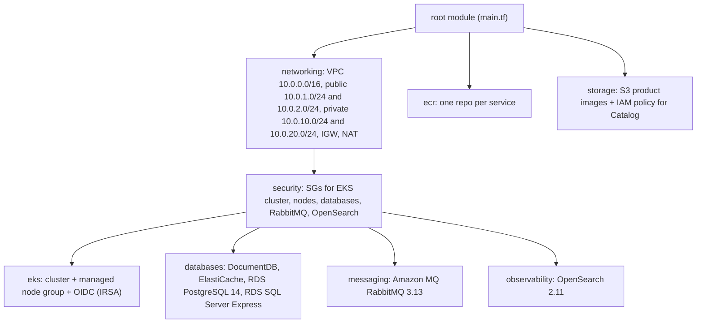
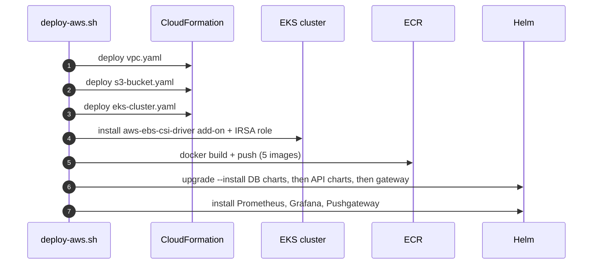

import { Aside, Tabs, TabItem } from '@astrojs/starlight/components';
import Src from '../../../components/Src.astro';

There are two infrastructure-as-code implementations for AWS, and they express different hosting models:

| | Terraform (<Src path="deploy/terraform" tree />) | CloudFormation (<Src path="deploy/aws/cloudformation" tree />) |
|---|---|---|
| Network | VPC, 2 public and 2 private subnets, 1 NAT gateway | Same shape (`vpc.yaml`) |
| Compute | EKS managed node group, OIDC provider for IRSA | EKS cluster and node group (`eks-cluster.yaml`), or all-in-one `minimal-stack.yaml` |
| Registry | ECR repository per service, scan on push, lifecycle policy | ECR created by the deploy script or CD workflow |
| Data | **Managed**: DocumentDB, ElastiCache Redis, RDS PostgreSQL, RDS SQL Server Express | **In-cluster** Helm releases (MongoDB, Redis, PostgreSQL, SQL Server) |
| Messaging | Amazon MQ for RabbitMQ 3.13 | In-cluster RabbitMQ chart |
| Logs | Amazon OpenSearch 2.11 | In-cluster Elasticsearch chart |
| Images | S3 bucket: versioned, encrypted, public access blocked, lifecycle rules | S3 bucket with a public-read `s3:GetObject` bucket policy (`s3-bucket.yaml`) |
| Driven by | `terraform plan/apply` (CI runs plan only) | <Src path="scripts/deploy/deploy-aws.sh" /> |

The CD workflow follows the **CloudFormation model**. It deploys the databases into the cluster with Helm. Terraform is the more production-shaped design, but nothing applies it automatically.

## Terraform

### Module graph

<Src path="deploy/terraform/main.tf" /> wires eight child modules together:



### Notable details

- **Network** (<Src path="deploy/terraform/modules/networking/main.tf" />): subnets spread across the first two availability zones. A single NAT gateway sits in the first public subnet. That is cheaper, but it makes one AZ a single point of failure for egress.
- **EKS** (<Src path="deploy/terraform/modules/eks/main.tf" />): Kubernetes `1.29` by default, with worker nodes in private subnets. The API endpoint allows both private and public access. The managed node group uses `t3.medium` (2 desired, 1 min, 4 max), a configurable `ON_DEMAND` or `SPOT` capacity type, and rolls one node at a time. An `aws_iam_openid_connect_provider` enables IRSA, so pods can assume IAM roles.
- **ECR** (<Src path="deploy/terraform/modules/ecr/main.tf" />): `scan_on_push = true`, `MUTABLE` tags (to allow `latest`), and a lifecycle policy that keeps the last 10 images and expires untagged ones after 7 days.
- **Data stores** (<Src path="deploy/terraform/modules/databases/main.tf" />): each service's store maps to its managed counterpart. MongoDB becomes DocumentDB, Redis becomes an ElastiCache replication group (Redis 7.0), PostgreSQL becomes RDS `postgres 14`, and SQL Server becomes RDS `sqlserver-ex 15.00`, the Express edition, chosen for cost. All sit in the private subnets behind the `databases` security group.
- **S3** (<Src path="deploy/terraform/modules/storage/main.tf" />): versioning, server-side encryption, all four public-access blocks on, and noncurrent versions transitioned after 30 days and expired after 90. The module also outputs an IAM policy meant for Catalog's service account through IRSA.
- **OpenSearch** (<Src path="deploy/terraform/modules/observability/main.tf" />): `t3.small.search`, a single node in dev, three dedicated masters when `environment == "prod"`, and zone awareness when the node count is above 1.
- **Versions** (<Src path="deploy/terraform/versions.tf" />): Terraform `>= 1.5.0`, AWS provider `~> 5.80`, TLS provider `~> 4.0`.

<Aside type="caution" title="Gaps">
- The **remote state backend is commented out** (<Src path="deploy/terraform/backend.tf" />), so state is local until you create the bucket and lock table and run `terraform init -migrate-state`.
- The S3 bucket **blocks public access**, but Catalog returns plain `https://{bucket}.s3.{region}.amazonaws.com/...` URLs and relies on "the bucket policy" for public reads (a comment in `S3ImageStorageService`). With the Terraform bucket, images would need CloudFront or pre-signed URLs.
- The app is not wired to the managed stores. The Helm values point at in-cluster services, and DocumentDB needs TLS options that Catalog's connection code does not set.
- CI runs `fmt`, `validate`, TFLint, a Trivy IaC scan, and `plan` on pull requests. There is no `apply` job.
- The names do not line up with CD. Terraform names the cluster `ecommerce-dev` and the repositories `ecommerce/catalog-api` and so on. The CD workflow expects a cluster named `<env>-ecommerce-eks`, which follows the CloudFormation naming, and pushes to repositories named `catalogapi` and so on, creating them if they are missing.
</Aside>

<Tabs>
<TabItem label="Plan locally">

```bash
cd deploy/terraform
cp terraform.tfvars.example terraform.tfvars   # set passwords, region, sizes
terraform init
terraform plan -out tf.plan
```

</TabItem>
<TabItem label="Apply">

```bash
terraform apply tf.plan
aws eks update-kubeconfig --name ecommerce-dev --region ap-southeast-1
```

</TabItem>
</Tabs>

## CloudFormation

The templates are modular and driven end to end by <Src path="scripts/deploy/deploy-aws.sh" /> (and the lighter <Src path="scripts/deploy/deploy-aws-minimal.sh" />):

| Template | Resources |
|---|---|
| <Src path="deploy/aws/cloudformation/vpc.yaml" /> | VPC, IGW, 4 subnets, NAT gateway with EIP, 3 route tables and 4 associations |
| <Src path="deploy/aws/cloudformation/eks-cluster.yaml" /> | EKS cluster role and security group, cluster, node role, managed node group |
| <Src path="deploy/aws/cloudformation/minimal-stack.yaml" /> | VPC and EKS in one stack, for the cost-optimised path |
| <Src path="deploy/aws/cloudformation/s3-bucket.yaml" /> | Product-image bucket and bucket policy |
| <Src path="deploy/aws/cloudformation/alb-ingress.yaml" /> | ALB, target group, listener (referenced but commented out in the deploy script) |

The script's flow: create or update the VPC, S3 and EKS stacks; install the EBS CSI driver add-on with an IRSA role (the database charts need persistent volumes); build and push images to ECR; `helm upgrade --install` the database, service and gateway charts; then install the community Prometheus, Grafana and Pushgateway charts for monitoring and k6 metrics. <Src path="scripts/cleanup/cleanup-aws.sh" /> tears everything down.



The CD workflow (<Src path=".github/workflows/cd.yml" />) assumes the cluster already exists. It authenticates to AWS with **GitHub OIDC** (`role-to-assume: secrets.AWS_ROLE_ARN`, `id-token: write`), so no long-lived keys are stored, and it deploys to a namespace per environment (`dev`, `staging`, `production`). See [CI/CD](/ci-cd/).
