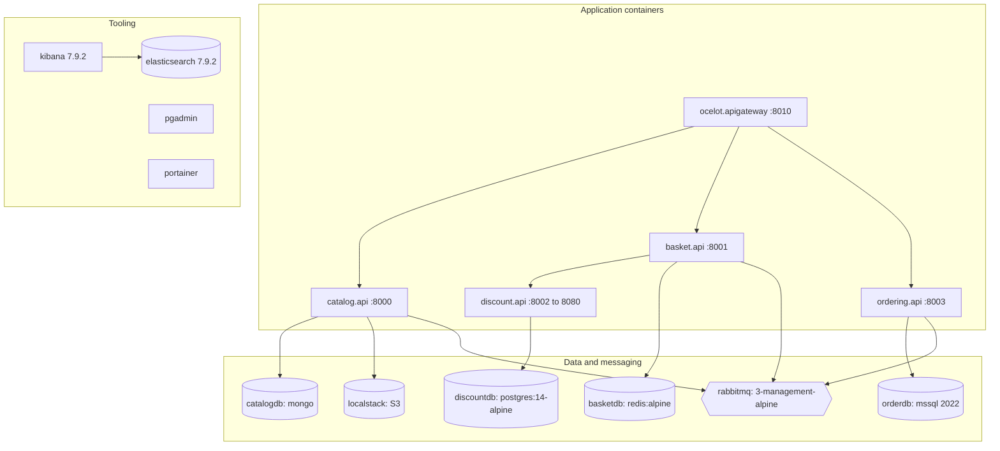

import { Aside } from '@astrojs/starlight/components';
import Src from '../../../components/Src.astro';

Local development runs the full backend in containers. The configuration is split across two files, a pattern Visual Studio's container tooling expects:

- <Src path="docker-compose.yml" /> declares **what** runs: images, and build contexts for the five .NET images.
- <Src path="docker-compose.override.yml" /> declares **how** it runs: container names, ports, environment, volumes, health checks and start-up ordering.

`docker compose up` merges both automatically. [Getting started](/getting-started/) lists every container and port.

## Topology



## Start-up ordering with health checks

`depends_on` with `condition: service_healthy` makes APIs wait for real readiness, not just a started container:

| Dependency | Health check |
|---|---|
| MongoDB | `mongosh ... --eval "db.adminCommand('ping').ok"` |
| PostgreSQL | `pg_isready -U admin -d postgres` |
| SQL Server | `grep -q 'SQL Server is now ready for client connections' /var/opt/mssql/log/errorlog` |
| Elasticsearch | `curl -f http://localhost:9200/_cluster/health?wait_for_status=yellow` (120 s start period) |
| LocalStack | `curl -f http://localhost:4566/_localstack/health` |

Redis and RabbitMQ only use `service_started`. The services cover the remaining races themselves: Discount retries its migration 5 times, Ordering wraps its migration in a Polly back-off, and EF Core retries transient SQL errors.

The APIs themselves have no health checks, because no service maps a health endpoint.

## Dockerfiles

All five Dockerfiles follow the same multi-stage pattern, for example <Src path="src/Services/Catalog/Catalog.API/Dockerfile" />:

```dockerfile
FROM mcr.microsoft.com/dotnet/aspnet:10.0 AS base
USER app                      # non-root user shipped in the .NET images
EXPOSE 80

FROM mcr.microsoft.com/dotnet/sdk:10.0 AS build
WORKDIR /repo
# 1. restore layer: copy only project files, the SDK pin and central package versions
COPY ["global.json", "Directory.Packages.props", "./"]
COPY ["src/BuildingBlocks/Common.Logging/Common.Logging.csproj", "src/BuildingBlocks/Common.Logging/"]
# ... every csproj in the service's project graph ...
RUN dotnet restore "src/Services/Catalog/Catalog.API/Catalog.API.csproj"
# 2. then the sources
COPY src/ src/
RUN dotnet build ... --no-restore

FROM build AS publish
RUN dotnet publish ... /p:UseAppHost=false --no-restore

FROM base AS final
COPY --from=publish /app/publish .
ENV ASPNETCORE_HTTP_PORTS=80
ENTRYPOINT ["dotnet", "Catalog.API.dll"]
```

The build context is the repository root, and the stages mirror the repository layout under `/repo`. Copying the full project graph, including `Common.Mediator` and `EventBus.Messages`, before `dotnet restore` means the restore layer stays cached until a `.csproj` or `Directory.Packages.props` changes. <Src path=".dockerignore" /> keeps `bin/`, `obj/`, `node_modules` and the frontends out of the context.

The final image runs as the non-root `app` user, but it listens on port 80. Binding to a port below 1024 as non-root depends on the runtime; moving to 8080 would remove that dependency.

## LocalStack for S3

Catalog stores product images in S3. Locally, LocalStack emulates it on port 4566 (`SERVICES=s3`). Catalog's Compose environment sets `USE_LOCALSTACK=true`, `AWS_ENDPOINT_URL=http://localstack:4566`, dummy credentials (`test`/`test`) and the bucket name `ecommerce-product-images`. Helper scripts create and verify the bucket and upload seed images:

- <Src path="scripts/init-localstack-s3.sh" />
- <Src path="scripts/migrate-images-to-localstack.sh" />
- <Src path="scripts/verify-localstack.sh" />

The legacy Angular app's product images are mounted read-only into the Catalog container at `/app/images/products`. That is where `MigrateImagesToS3` reads from.

<Aside type="caution" title="Development-only credentials">
<Src path=".env.example" /> and the Compose override contain plain-text default passwords (`admin1234`, `SqlPassword123`, `guest/guest`). The MongoDB container is initialised with a root user, but the default `MONGODB_URL` connects without credentials. These are fine for a laptop and must never reach a shared environment.
</Aside>
