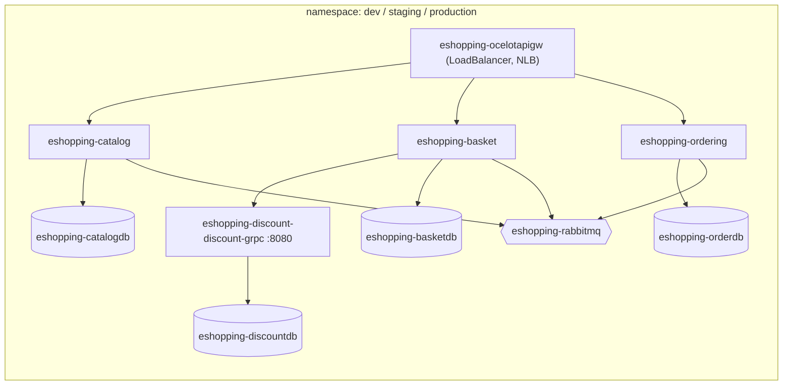

import { Aside, FileTree } from '@astrojs/starlight/components';
import Src from '../../../components/Src.astro';

The repository has two parallel ways to put the platform on Kubernetes:

1. **Raw manifests** in <Src path="deploy/k8s" tree />, applied by <Src path="deploy/k8s/deploy-all.sh" />. Used for Minikube demos and the PR workflow that deploys to Minikube.
2. **Helm charts** in <Src path="deploy/helm" tree />, installed by <Src path="deploy/helm/install-helm.sh" /> locally and by the CD workflow on EKS.

## Raw manifests

<FileTree>
- deploy/k8s/
  - deploy-all.sh one-shot Minikube deployment (infra, DBs, APIs, gateway, Prometheus, tools, Istio)
  - namespace.yaml `ecommerce` and `monitoring` namespaces
  - configmaps.yaml
  - secrets.yaml
  - catalog/ basket/ discount/ ordering/ Deployment + Service per API and DB
  - databases/ mongodb, redis, postgresql, sqlserver
  - gateway/ Ocelot Deployment + route ConfigMap
  - infrastructure/ rabbitmq, elasticsearch, kibana
  - monitoring/ prometheus (kubernetes_sd pod scraping), grafana, rbac
  - ingress/ Ingress rules for api-local.eshopping.com (gateway) and localhost (API and monitoring)
  - network-policies/ default-deny + allow-dns
  - pod-disruption-budgets/ minAvailable 1 per API
  - management/ portainer, pgadmin
</FileTree>

`deploy-all.sh` applies the pieces in dependency order: RabbitMQ, Elasticsearch and Kibana; then the four databases; then waits; then the four APIs and the gateway; then Prometheus, the management tools, and finally Istio. It downloads the latest Istio release with `istioctl`, labels the `default` namespace for sidecar injection, and applies Istio's sample Jaeger, Kiali and Grafana add-ons.

Pods opt into the mesh with `sidecar.istio.io/inject: "true"`. The exceptions are `ordering-api` and `ordering-db`, which set it to `"false"`, so traffic to and from Ordering bypasses the mesh (no mTLS, no Istio metrics).

<Aside type="caution" title="Defined but not applied">
<Src path="deploy/k8s/network-policies/default-deny.yaml" />, <Src path="deploy/k8s/network-policies/allow-dns.yaml" /> and <Src path="deploy/k8s/pod-disruption-budgets/microservices-pdb.yaml" /> target the `ecommerce` namespace, but `deploy-all.sh` deploys into `default` and does not apply them. As written, `default-deny-all` blocks **all** ingress and egress except DNS. Applied on its own, it would cut every service off, because there are no allow rules for app-to-app or app-to-database traffic. Treat these as a starting point for a zero-trust policy set, not a finished one. The API Deployments also have no liveness or readiness probes; `validate-manifests-simple.sh` warns about this.
</Aside>

## Helm charts

Each service, datastore and tool has its own chart. Every chart has the standard `Chart.yaml`, `values.yaml`, `_helpers.tpl`, templates and a `helm test` connection pod.

| Chart | Kind | Notable values |
|---|---|---|
| <Src path="deploy/helm/catalog" tree /> | API | HPA enabled (1 to 100 replicas, 80% CPU and memory), `values-aws.yaml` for IRSA and S3 |
| <Src path="deploy/helm/basket" tree /> | API | |
| <Src path="deploy/helm/discount" tree /> | API | Service named `eshopping-discount-discount-grpc`, port 8080 |
| <Src path="deploy/helm/ordering" tree /> | API | |
| <Src path="deploy/helm/ocelotapigw" tree /> | Gateway | `ASPNETCORE_ENVIRONMENT=k8s`, `Service` type `LoadBalancer` with the AWS NLB annotation |
| `catalogdb`, `basketdb`, `discountdb`, `orderdb` | Datastores | In-cluster MongoDB, Redis, PostgreSQL, SQL Server |
| `rabbitmq`, `elasticsearch`, `kibana` | Infra | |
| `localstack`, `pgadmin`, `portainer` | Dev tooling | |
| <Src path="deploy/helm/prometheus/prometheus-values.yaml" /> | Values only | For the community Prometheus chart |

Configuration reaches the pods through a per-chart ConfigMap. `values.yaml` lists which keys become environment variables, for example `DatabaseSettings__ConnectionString` and `EventBusSettings__HostAddress`. Images default to `repository: catalogapi, tag: latest`. The CD workflow overrides `image.registry` with the ECR registry.

### How CD uses the charts

The `deploy-to-eks` job in <Src path=".github/workflows/cd.yml" /> runs, in order:

1. `helm upgrade --install eshopping-{catalogdb,basketdb,discountdb,orderdb,rabbitmq}` with `--wait`.
2. `helm upgrade --install eshopping-{catalog,basket,discount,ordering}`. Catalog additionally gets `env.USE_LOCALSTACK='false'` and an empty `AWS__S3__ServiceUrl`, so it talks to real S3.
3. `helm upgrade --install eshopping-ocelotapigw`.
4. `kubectl wait` for all Deployments, then <Src path="scripts/migrate-products-to-aws-s3.sh" /> rewrites seeded product image URLs to the AWS bucket.

In this path the databases run **inside the cluster** as Helm releases, not on the managed AWS services that Terraform can provision. See [AWS](/infrastructure/aws/).

## Scaling and resilience settings

| Mechanism | Where | Setting |
|---|---|---|
| HorizontalPodAutoscaler | Helm `autoscaling.*` (enabled for Catalog only) | CPU and memory 80%, up to 100 replicas |
| Resource requests and limits | Helm values | For example, Catalog requests 50m and 64Mi, with limits of 500m and 512Mi |
| PodDisruptionBudget | raw manifests | `minAvailable: 1` for each API |
| Replicas | raw manifests | 1 per Deployment |

With one replica per service, a PDB of `minAvailable: 1` blocks voluntary eviction entirely, and node drains will hang. Raising replicas to 2 or more, or using `maxUnavailable: 1`, is the usual fix.
