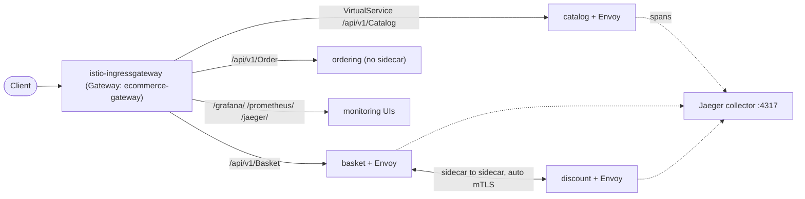

import { Aside } from '@astrojs/starlight/components';
import Src from '../../../components/Src.astro';

Istio adds a sidecar proxy (Envoy) to each opted-in pod. Without any change to service code, the mesh gains traffic metrics, distributed-tracing spans at the proxy, mutual TLS between sidecars, and an ingress gateway. The configuration lives in <Src path="deploy/istio" tree />.

## What is in the folder

| File | Purpose |
|---|---|
| <Src path="deploy/istio/istio-init.yaml" /> | Istio CRDs (from the Istio Helm chart) |
| <Src path="deploy/istio/istio-minikube.yaml" /> | A rendered Istio **1.10.3** control plane and add-ons (Prometheus 2.21, Grafana 7.2, Jaeger all-in-one 1.20, Kiali 1.23) for offline Minikube installs |
| <Src path="deploy/istio/gateway.yaml" /> | `Gateway` `ecommerce-gateway` on the default `istio: ingressgateway`, port 80, all hosts |
| <Src path="deploy/istio/virtualservices.yaml" /> | Routes `/api/v1/Catalog`, `/api/v1/Basket`, `/api/v1/Order`, `/api/v1/Discount` from the ingress gateway to the services |
| <Src path="deploy/istio/monitoring-virtualservices.yaml" /> | `/grafana/`, `/prometheus/`, `/jaeger/` through the same gateway |
| <Src path="deploy/istio/telemetry-tracing.yaml" /> | `Telemetry` `mesh-default`: Jaeger provider, **100% sampling** |
| <Src path="deploy/istio/tracing-config.yaml" /> | The same Telemetry resource, plus an `IstioOperator` `extensionProviders` entry for Jaeger over OpenTelemetry on port 4317 |
| <Src path="deploy/istio/kiali-secret.yaml" /> | Kiali login credentials |

<Src path="deploy/k8s/deploy-all.sh" /> does not use the pinned 1.10.3 manifest. It downloads the current Istio release, runs `istioctl install`, and applies that release's `samples/addons` for Jaeger, Kiali and Grafana. The rendered 1.10.3 file is an older, frozen alternative.

## Traffic paths



There are two entry points into the cluster. Istio's ingress gateway routes straight to the services on their `/api/v1/...` paths, and the Ocelot gateway Service (type `LoadBalancer` in Helm) uses the friendly paths. They are alternatives, and you do not need both. With Istio in front, the Ocelot layer could be dropped, or kept only for response caching and rate limiting.

## mTLS: what is and is not configured

<Aside type="caution" title="No explicit mTLS policy">
The repository contains **no `PeerAuthentication` or `DestinationRule` resources**. Mutual TLS therefore comes from Istio's defaults: **auto mTLS in PERMISSIVE mode**. Sidecar-to-sidecar traffic is upgraded to mTLS automatically, and plaintext is still accepted. That covers pods without sidecars, such as Ordering, whose Deployments set `sidecar.istio.io/inject: "false"`.
</Aside>

To enforce mTLS mesh-wide, add:

```yaml
apiVersion: security.istio.io/v1
kind: PeerAuthentication
metadata:
  name: default
  namespace: istio-system
spec:
  mtls:
    mode: STRICT
```

Before doing that, give Ordering and its database a sidecar (or add a port-level exception), or their traffic will be rejected. `AuthorizationPolicy` resources, which would restrict for example Discount to calls from Basket only, would be the next step toward zero trust.

## Tracing through the mesh

Two layers produce spans:

1. **Envoy sidecars** report a span for every hop according to the mesh `Telemetry` resource, with 100% sampling to the `jaeger` extension provider (OTLP on `jaeger-collector.istio-system:4317`). 100% sampling suits a demo; production would typically use 1 to 10%.
2. **The services** export their own OpenTelemetry spans to the same collector (see [Logging](/building-blocks/logging/#tracing-per-service-not-in-the-shared-library)).

Envoy propagates trace headers across the proxy hop, but the application must copy them from the incoming request onto outgoing calls. The OpenTelemetry ASP.NET Core and gRPC-client instrumentation does that for the Basket-to-Discount call, so both layers join into one trace. RabbitMQ traffic goes through the sidecar as opaque TCP, so the mesh cannot follow a message from publisher to consumer.

## Observability add-ons

- **Kiali**: service graph built from Istio metrics, showing live traffic between services and mTLS status per edge. The `scripts/monitoring/fix-kiali-prometheus-connection.sh` helper points Kiali at the right Prometheus.
- **Grafana**: Istio's mesh, service and workload dashboards, plus the project's own dashboards (see [Observability](/observability/)).
- **Jaeger**: trace search and timelines.
