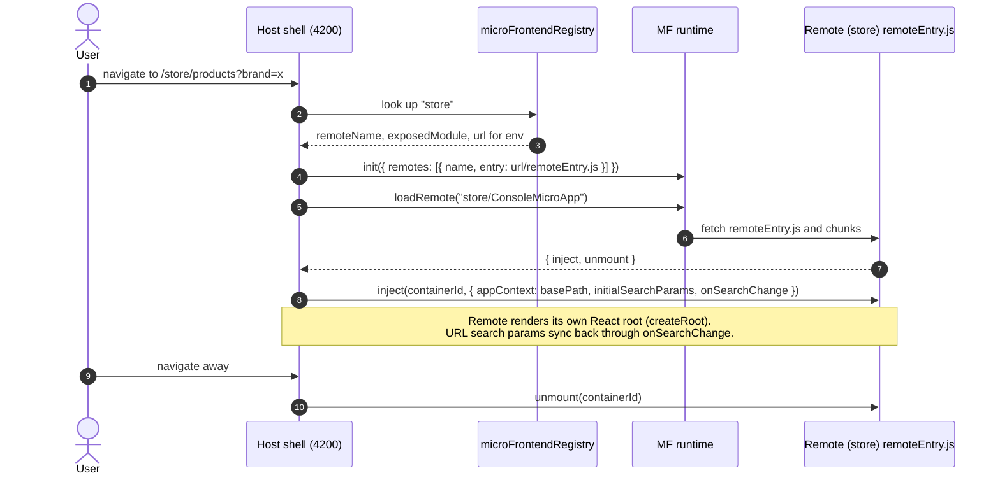

import { Aside } from '@astrojs/starlight/components';
import Src from '../../components/Src.astro';

The storefront and admin UI live in <Src path="frontend/web" tree />: an **Nx 23.2.1** monorepo of React 18 applications composed at runtime with **Webpack Module Federation**. The original Angular single-page app is kept in <Src path="frontend/legacy-angular" tree /> for reference and is no longer developed (see <Src path="frontend/README.md" />).

## Applications

| App | Dev port | Role | Federation |
|---|---|---|---|
| `host` | 4200 | Shell: layout, routing, MSAL sign-in, loads remotes | consumer; no static remotes in production |
| `store` | 4201 | Product browsing and search | exposes `./ConsoleMicroApp` |
| `checkout` | 4202 | Cart and checkout | exposes `./ConsoleMicroApp` |
| `account` | 4203 | Profile and order history | exposes `./ConsoleMicroApp` |
| `admin` | 4204 | Product management, analytics, activity feed | exposes `./ConsoleMicroApp` |

Every remote exposes the **same module name**, `ConsoleMicroApp`, which points at its `src/remote-entry.ts` (for example <Src path="frontend/web/store/module-federation.config.ts" />). A uniform contract means the host needs no per-remote code.

## Runtime composition

The host does not declare remotes at build time. <Src path="frontend/web/host/webpack.config.prod.ts" /> sets `remotes: []`. Remotes are resolved at runtime from a registry:

- <Src path="frontend/web/host/src/config/microFrontendRegistry.ts" /> lists each app's `name`, `remoteName`, `exposedModule` and `basePath`, with URLs per environment. In dev, each remote is `http://localhost:420x`. In staging and production, remotes live under the same origin at `/remotes/<name>`.
- <Src path="frontend/web/host/src/microFe/MicroFrontendApp.tsx" /> calls `init()` and `loadRemote()` from `@module-federation/runtime` with `${url}/remoteEntry.js`, then calls the remote's `inject(containerId, { config })`, and calls `unmount` on cleanup.

### The injector contract

<Src path="frontend/web/packages/app-injector/src/createAppInjector.tsx" /> wraps any React component into `{ inject, unmount }`. It uses React 18's `createRoot` on the container element and keeps the root so it can unmount it later. Each remote's `injector.ts` is three lines around it. The design lets remotes own their own React tree, router (TanStack Router in the remotes) and state, so the host only needs a DOM element and a config object.

## Shared packages

| Package | Purpose |
|---|---|
| <Src path="frontend/web/packages/app-injector" tree /> | `createAppInjector` and `createEnhancedAppInjector`: the mount/unmount contract |
| <Src path="frontend/web/packages/auth-provider" tree /> | `EcommerceAuthProvider`, which switches between an MSAL (Azure AD B2C) provider and an internal provider, plus the `useAuth` hook and an error boundary |
| <Src path="frontend/web/packages/shared-layout" tree /> | Navbar, Footer, Layout, CartPreview, LanguageSwitcher |

The packages are built with `tsup` (`npm run build:packages`) and copied into `node_modules/@ecommerce-platform/*` during the Amplify build, so every app uses the local build.

## Stack

React 18.3, TanStack Router and Query, Zustand, Axios, Ant Design 5, MSAL (`@azure/msal-browser`, `@azure/msal-react`), Nx 23.2.1 with `@nx/react` and `@nx/module-federation`, and webpack 5.104.1. The configuration only passes `NX_*` environment variables to the bundle, through `DefinePlugin`. `NX_API_BASE_URL` points at the Ocelot gateway and defaults to `http://localhost:8010` (<Src path="frontend/web/host/src/config/env.config.ts" />).

<Aside type="note" title="Auth reality check">
The host signs users in with Azure AD B2C, and the store and checkout HTTP clients attach a `Bearer` token to API calls. The backend does not validate it yet. JWT validation at the gateway is [planned](/roadmap/).
</Aside>

## Build and deploy

<Src path="frontend/web/amplify.yml" /> builds everything on AWS Amplify: `npm ci`, `build:packages`, then `nx run-many --target=build --configuration=production --all`. It then assembles a single artifact with the host at the root and each remote copied to `dist/deploy/remotes/<name>`. <Src path="frontend/web/host/src/_redirects" /> serves `/remotes/*` as-is and falls back to `index.html` for client-side routes. Serving remotes from the same origin removes CORS from remote loading and lets one deploy ship all apps. The trade-off is that the remotes are no longer deployed independently in this setup.

In CI, the `frontend-quality` job runs `nx affected` lint, test and build (see [CI/CD](/ci-cd/)). The micro-frontend Playwright suites are described in [Testing](/testing/#frontend-tests).
