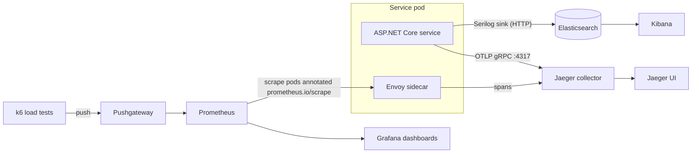

import { Aside } from '@astrojs/starlight/components';
import Src from '../../components/Src.astro';

The platform covers all three signals, but they come from different places and cover different amounts of the system. This page describes what really gets collected.

## Signal coverage

| Signal | Source | Backend | Coverage |
|---|---|---|---|
| Logs | Serilog in every service (`Common.Logging`) | Elasticsearch 7.9.2 (Compose, Kubernetes) or OpenSearch (Terraform), viewed in Kibana | all services |
| Traces: app | OpenTelemetry ASP.NET Core (+ gRPC client in Basket), OTLP exporter | Jaeger | HTTP and gRPC only |
| Traces: mesh | Istio `Telemetry`, 100% sampling | Jaeger | sidecar-enabled pods only |
| Metrics: mesh | Envoy (`istio_requests_total`, `istio_request_duration_milliseconds_*`) | Prometheus, Grafana | sidecar-enabled pods only |
| Metrics: app | none | none | not implemented |
| Metrics: load tests | k6 through Pushgateway | Prometheus, Grafana | on demand |
| Health | none; no `/health` endpoints and no probes | none | planned |

## Logs: Elasticsearch and Kibana

Every service writes structured JSON events to the index `ecommerce-Logs-{yyyy.MM.dd}`, enriched with `ApplicationName`, `EnvironmentName` and exception details (see [Common.Logging](/building-blocks/logging/)). In Kibana, create an index pattern `ecommerce-logs-*` and filter by `fields.ApplicationName`. Consumer logs carry the `correlationId` scope, so you can reconstruct one checkout across Basket and Ordering.

- Compose: Kibana on http://localhost:5601.
- Kubernetes: <Src path="deploy/k8s/infrastructure/elasticsearch.yaml" /> and <Src path="deploy/k8s/infrastructure/kibana.yaml" />, or the `elasticsearch` and `kibana` Helm charts.

## Metrics: Prometheus and Grafana

The services expose **no `/metrics` endpoint**: there is no `prometheus-net` package and no OpenTelemetry metrics exporter. Everything Prometheus knows about the application comes from the Envoy sidecars, which report request counts, latency histograms and response codes per source and destination workload.

- Prometheus in <Src path="deploy/k8s/monitoring/prometheus" tree /> uses `kubernetes_sd_configs` pod discovery and keeps pods annotated `prometheus.io/scrape: "true"`, honouring the `prometheus.io/path` and `prometheus.io/port` annotations. Istio's sidecar injector adds these annotations to meshed pods, which is how the Envoy metrics get scraped.
- The dashboards in <Src path="deploy/monitoring/grafana/dashboards" tree />:
  - **E-Commerce Service Request Metrics (Istio)**: request volume, P50, P95 and P99 latency, error rate, RPS and response codes per service, all computed from `istio_requests_total` and `istio_request_duration_milliseconds_bucket`. This one works out of the box.
  - **E-Commerce Performance Dashboard**: system, database, cache, queue and gateway panels.
  - **E-Commerce Business Metrics**: revenue, orders, funnel and top products.
  - The k6 dashboard (<Src path="deploy/monitoring/grafana/k6-dashboard.json" />) visualizes load-test runs pushed through Pushgateway.

<Aside type="caution" title="Dashboards ahead of the code">
The business dashboard queries series such as `revenue_total`, `orders_total` and `orders_created_total`. **No service emits these metrics**, so those panels stay empty until app-level metrics are added, for example with `System.Diagnostics.Metrics` counters in the Ordering handlers exported through OpenTelemetry's Prometheus exporter. Ordering and its database also run without sidecars, so Ordering is missing from the Istio-based panels.
</Aside>

## Traces: Jaeger

Each service exports spans over OTLP gRPC to `Otlp:Endpoint`, which defaults to `http://jaeger-collector.istio-system:4317`. The Istio sidecars send their own spans to the same collector through the `jaeger` extension provider (<Src path="deploy/istio/tracing-config.yaml" />).

What a trace looks like today:

| Journey | What you see in Jaeger |
|---|---|
| Browse catalog | gateway (sidecar), then the Catalog server span. No MongoDB span |
| Add to cart | Basket server span, then the gRPC client span, then the Discount server span, in one connected trace |
| Checkout | Basket server span, ending at the publish. The Ordering consumer's work is **not** in the same trace, because MassTransit instrumentation is not registered |

Adding `.AddSource("MassTransit")` and the EF Core, Redis and MongoDB instrumentation packages would turn checkout into one end-to-end trace. MassTransit propagates W3C trace context in message headers once its activity source is listened to.

## Service graph: Kiali

Kiali draws the live topology from Istio telemetry: which workloads call which, with request rates, error rates and whether each edge is mTLS. Access it through the Istio add-ons (`istioctl dashboard kiali`) or the monitoring ingress.

## Useful scripts

<Src path="scripts/monitoring" tree /> contains helpers written while getting the stack running on Minikube and EKS: checking Grafana and Prometheus health, connecting Grafana to Prometheus, enabling Istio metrics, and fixing Kiali's Prometheus connection.
