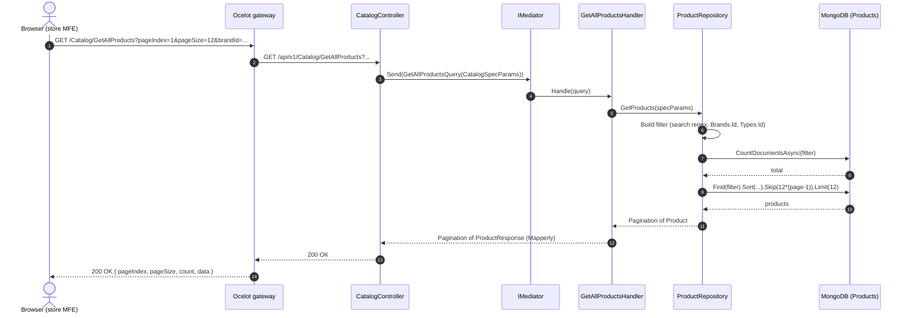
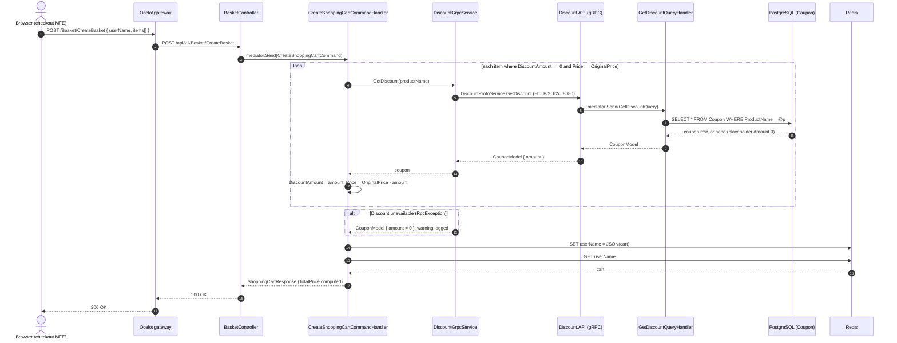
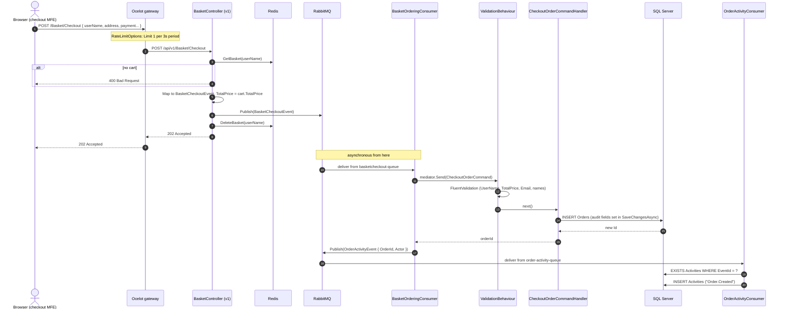
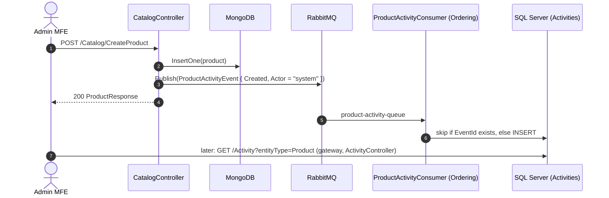

import { Aside } from '@astrojs/starlight/components';
import Src from '../../components/Src.astro';

Each diagram below follows the actual call chain: gateway route, controller, mediator request, handler, repository and store. The file references let you follow along in the code.

## 1. Browse the catalog

A shopper opens the store, which requests the first page of products with a brand filter.

Code path: route in <Src path="src/ApiGateways/Ocelot.ApiGateway/ocelot.Development.json" />, then <Src path="src/Services/Catalog/Catalog.API/Controllers/CatalogController.cs" />, <Src path="src/Services/Catalog/Catalog.Application/Handlers/GetAllProductsHandler.cs" /> and <Src path="src/Services/Catalog/Catalog.Infrastructure/Repositories/ProductRepository.cs" />.

Brands and types for the filter sidebar come from `GET /Catalog/GetAllBrands` and `GET /Catalog/GetAllTypes`, which follow the same shape with a plain `Find(_ => true)`. Product images are loaded by the browser **directly from S3** (or LocalStack), using the URL stored in `ImageFile`. They never pass through the API.

## 2. Add to cart, with a discount lookup over gRPC

The cart is saved as a whole on every change. For each item that has no discount yet, Basket asks Discount for a coupon.

Code path: <Src path="src/Services/Basket/Basket.Application/Handlers/CreateShoppingCartCommandHandler.cs" />, <Src path="src/Services/Basket/Basket.Application/GrpcService/DiscountGrpcService.cs" />, <Src path="src/Services/Discount/Discount.API/Services/DiscountService.cs" />, <Src path="src/Services/Discount/Discount.Application/Handlers/GetDiscountQueryHandler.cs" /> and <Src path="src/Services/Basket/Basket.Infrastructure/Repositories/BasketRepository.cs" />.

Points to notice:

- The lookups are **sequential**, one round trip per new item. For large carts, a batched `GetDiscounts(names[])` RPC or `Task.WhenAll` would cut latency.
- The discount is applied **once**, and the item's state (`DiscountAmount != 0`) records that it was applied. The coupon is not re-evaluated if it changes later.
- The gRPC hop is traced end to end: Basket registers the gRPC client instrumentation, and Discount's ASP.NET Core instrumentation picks up the propagated context.

## 3. Checkout: BasketCheckoutEvent to Ordering

Checkout is split into a synchronous half, which completes with `202 Accepted`, and an asynchronous half, where Ordering creates the order.

Code path: <Src path="src/Services/Basket/Basket.API/Controllers/BasketController.cs" />, <Src path="src/Services/Ordering/Ordering.API/EventBusConsumer/BasketOrderingConsumer.cs" />, <Src path="src/Services/Ordering/Ordering.Application/Behaviour/ValidationBehaviour.cs" />, <Src path="src/Services/Ordering/Ordering.Application/Handlers/CheckoutOrderCommandHandler.cs" /> and <Src path="src/Services/Ordering/Ordering.API/EventBusConsumer/OrderActivityConsumer.cs" />.

<Aside type="caution" title="Failure modes worth knowing">
- **Publish succeeds, cart delete fails:** the order is created, and the cart reappears for the user.
- **Process crashes between the DB insert and `Publish(OrderActivityEvent)`:** the order exists, but the activity feed never shows it. There is no outbox.
- **Validation fails in the consumer** (for example, an empty email): the message faults to `basketcheckout-queue_error`. The user already received `202`, and nothing notifies them.
- **The client polls** `GET /Order/{userName}` to see the order, because there is no push or status endpoint.
</Aside>

### The v2 variant

`POST /Basket/CheckoutV2` goes to `api/v2/Basket/Checkout`. That endpoint publishes `BasketCheckoutEventV2` (user name and total only) to `basketcheckout-queue-v2`, where `BasketOrderingConsumerV2` creates a minimal order through `CheckoutOrderCommandV2`. It does not publish an activity event.

## Product activity (admin feed)

The activity feed lives in Ordering's database even though it records Catalog events. It works as a read model built from events, and the admin dashboard reads it through `GET /Activity`, which the gateway caches for 10 seconds.
