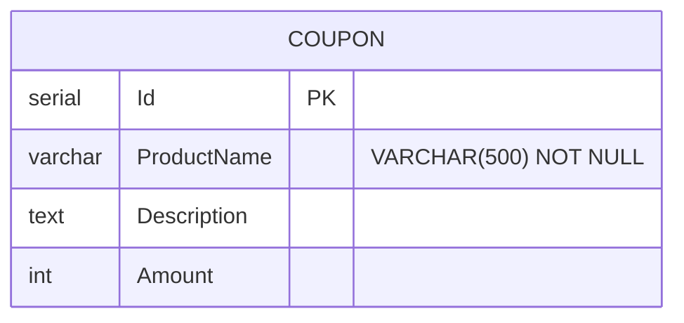

import { Aside } from '@astrojs/starlight/components';
import Src from '../../../components/Src.astro';

Discount stores one coupon per product name and serves it over gRPC. It has no REST controllers. Its only client in the codebase is the Basket service.

| | |
|---|---|
| Source | <Src path="src/Services/Discount" tree /> |
| Store | PostgreSQL, `Coupon` table, accessed with Npgsql and Dapper |
| Protocol | gRPC over HTTP/2 cleartext, Kestrel endpoint `http://0.0.0.0:8080` |
| Contract | <Src path="src/Services/Discount/Discount.Application/Protos/discount.proto" /> |
| Local port | 8002 → container 8080 |

## Layers

| Project | What is in it |
|---|---|
| <Src path="src/Services/Discount/Discount.API" tree /> | `DiscountService : DiscountProtoServiceBase`, which maps each RPC to a mediator request; `Program.cs` runs the DB migration at startup |
| <Src path="src/Services/Discount/Discount.Application" tree /> | The `.proto` (compiled with `GrpcServices="Server"`), commands, a query, handlers, `DiscountMapper` |
| <Src path="src/Services/Discount/Discount.Core" tree /> | `Coupon` entity, `IDiscountRepository` |
| <Src path="src/Services/Discount/Discount.Infrastructure" tree /> | `DiscountRepository` (Dapper SQL), `DbExtension.MigrateDatabase` |

## gRPC contract

```protobuf
service DiscountProtoService {
  rpc GetDiscount(GetDiscountRequest) returns (CouponModel);
  rpc CreateDiscount(CreateDiscountRequest) returns (CouponModel);
  rpc UpdateDiscount(UpdateDiscountRequest) returns (CouponModel);
  rpc DeleteDiscount(DeleteDiscountRequest) returns (DeleteDiscountResponse);
}

message CouponModel {
  int32 id = 1;
  string productName = 2;
  string description = 3;
  int32 amount = 4;
}
```

| RPC | Mediator request | Repository SQL |
|---|---|---|
| `GetDiscount` | `GetDiscountQuery` | `SELECT * FROM Coupon WHERE ProductName = @ProductName` |
| `CreateDiscount` | `CreateDiscountCommand` | `INSERT INTO Coupon (ProductName, Description, Amount) ...` |
| `UpdateDiscount` | `UpdateDiscountCommand` | `UPDATE Coupon SET ... WHERE Id = @Id` |
| `DeleteDiscount` | `DeleteDiscountCommand` | `DELETE FROM Coupon WHERE ProductName = @ProductName` |

All queries are parameterized through Dapper (<Src path="src/Services/Discount/Discount.Infrastructure/Repositories/DiscountRepository.cs" />). Each call opens a new `NpgsqlConnection`, and Npgsql connection pooling makes that cheap.

`Amount` is an `int32`, so discounts are whole currency units. Basket subtracts it from the unit price.

## Data model



## Startup migration

`app.MigrateDatabase<Program>()` (<Src path="src/Services/Discount/Discount.Infrastructure/Extensions/DbExtension.cs" />) runs before the host starts:

1. Connects to the `postgres` maintenance database and creates the target database if `pg_database` does not list it.
2. In one transaction, takes a PostgreSQL advisory lock (`pg_advisory_xact_lock`) so replicas starting together cannot race, then runs `CREATE TABLE IF NOT EXISTS Coupon(...)` and a unique index on `ProductName`.
3. Seeds two coupons, `ASUS ZenBook 13 OLED Ultrabook` (500) and `ASUS ROG Zephyrus G14 Gaming Laptop` (700), **only when the table is empty**, with `INSERT ... ON CONFLICT DO NOTHING`. Seed coupons an admin deleted do not come back.
4. Retries transient connection failures with exponential back-off and **fails fast** (the process exits) if the database is still unreachable, instead of starting a broken service.

<Aside type="note" title="Fixed in #562">
Startup used to run `DROP TABLE IF EXISTS Coupon` and reseed, so coupons created through `CreateDiscount` disappeared on every restart. <Src path="tests/integration/Discount.IntegrationTests" tree /> now proves coupons survive a second startup and that four concurrent startups seed exactly once.
</Aside>

## Implementation notes

- **Missing coupons are not errors.** `GetDiscountQueryHandler` throws `RpcException(StatusCode.NotFound)` when the repository returns `null`. The repository never does: it returns a placeholder `Coupon { ProductName = "No Discount", Amount = 0 }`. The effective behaviour is "no coupon means a zero discount", which suits Basket, but the NotFound branch is dead code.
- **Mapping.** `DiscountMapper` is a Mapperly source-generated mapper registered as a singleton. `Create` ignores `Id`, because the database generates it.
- **Handlers return protobuf types.** Handlers return `CouponModel` (a generated gRPC type), so `Discount.Application` depends on the transport contract.
- **Nothing reaches it over HTTP.** The Ocelot route files still contain `/Discount` REST routes, and <Src path="deploy/istio/virtualservices.yaml" /> has a discount VirtualService matching `/api/v1/Discount`. Discount has no REST controllers, so these routes cannot be served. Coupon administration would need a REST facade, gRPC-JSON transcoding, or a gRPC-capable gateway route.
- **No tracing of Npgsql.** Only ASP.NET Core instrumentation is registered, so incoming gRPC calls are traced, but database calls are not.
