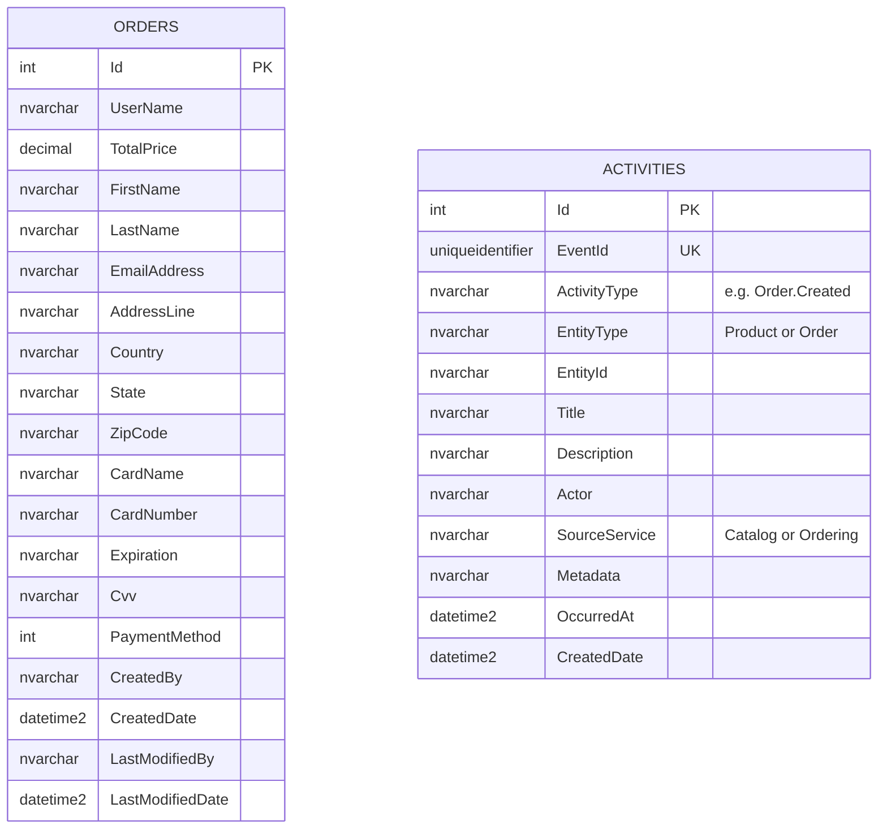
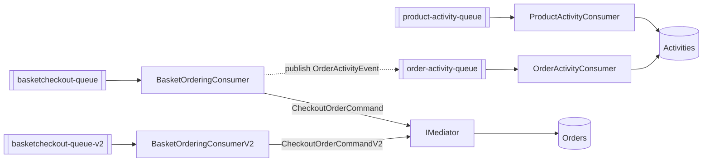

import { Aside } from '@astrojs/starlight/components';
import Src from '../../../components/Src.astro';

Ordering turns checkout events into persisted orders. It exposes order queries and administration over REST, and it keeps an **activity feed** that records product and order events for the admin dashboard. It is the only service that uses EF Core, FluentValidation and mediator pipeline behaviours.

| | |
|---|---|
| Source | <Src path="src/Services/Ordering" tree /> |
| Store | SQL Server: `Orders` and `Activities` tables (EF Core 10) |
| Consumes | `BasketCheckoutEvent`, `BasketCheckoutEventV2`, `ProductActivityEvent`, `OrderActivityEvent` |
| Publishes | `OrderActivityEvent` |
| Local port | 8003 (container port 80) |

## Layers

| Project | What is in it |
|---|---|
| <Src path="src/Services/Ordering/Ordering.API" tree /> | `OrderController`, `ActivityController`, four MassTransit consumers in `EventBusConsumer/`, a startup migration with Polly retry, `Program.cs` |
| <Src path="src/Services/Ordering/Ordering.Application" tree /> | Commands, queries and handlers, `ValidationBehaviour` and `UnhandledExceptionBehaviour`, FluentValidation validators, `OrderMapper`, exceptions |
| <Src path="src/Services/Ordering/Ordering.Core" tree /> | `EntityBase` (audit fields), `Order`, `Activity`, `IAsyncRepository<T>`, `IOrderRepository`, `IActivityRepository` |
| <Src path="src/Services/Ordering/Ordering.Infrastructure" tree /> | `OrderContext` (EF Core), migrations, `RepositoryBase<T>`, `OrderRepository`, `ActivityRepository`, seed data |

Service registration is split into extension methods, `AddApplicationServices()` (<Src path="src/Services/Ordering/Ordering.Application/Extensions/ServiceRegistration.cs" />) and `AddInfraServices()` (<Src path="src/Services/Ordering/Ordering.Infrastructure/Extensions/InfraServices.cs" />), which keeps `Program.cs` short.

## Endpoints

| Method | Route | Handler | Notes |
|---|---|---|---|
| GET | `api/v1/Order/{userName}` | `GetOrderListQuery` | All orders for a user |
| POST | `api/v1/Order` | `CheckoutOrderCommand` | Marked "just for testing" in code; creates an order directly and publishes `OrderActivityEvent` |
| PUT | `api/v1/Order` | `UpdateOrderCommand` | `204`; throws `OrderNotFoundException` if missing |
| DELETE | `api/v1/Order/{id}` | `DeleteOrderCommand` | `204`; throws `OrderNotFoundException` if missing |
| GET | `api/v1/Activity?pageIndex&pageSize&activityType&entityType&from&to&actor` | `GetRecentActivitiesQuery` | Zero-based paging, newest first |

Sources: <Src path="src/Services/Ordering/Ordering.API/Controllers/OrderController.cs" /> and <Src path="src/Services/Ordering/Ordering.API/Controllers/ActivityController.cs" />.

## Data model



`OrderContext.SaveChangesAsync` fills the audit fields (`CreatedDate` and `CreatedBy` on insert, `LastModified*` on update) for every `EntityBase` entry. The user is hard-coded as `"slowey"`, with a `TODO: Replace with auth server` (<Src path="src/Services/Ordering/Ordering.Infrastructure/Data/OrderContext.cs" />).

`Activities` has a unique constraint on `EventId` and indexes on `CreatedDate`, `OccurredAt`, `ActivityType` and `EntityType`. The seeder creates the table with raw SQL (`IF NOT EXISTS ...`) as a safety net in case the `AddActivitiesTable` migration was not applied (<Src path="src/Services/Ordering/Ordering.Infrastructure/Data/OrderContextSeed.cs" />).

## Event consumers

All four consumers are registered with MassTransit in <Src path="src/Services/Ordering/Ordering.API/Program.cs" />, each on its own named receive endpoint:



- **`BasketOrderingConsumer`** maps the event to `CheckoutOrderCommand` with `OrderMapper`, sends it through the mediator (so validation runs), and publishes an `OrderActivityEvent` when an order ID comes back. It opens a logging scope with the event's `CorrelationId`.
- **`ProductActivityConsumer`** and **`OrderActivityConsumer`** write directly to `IActivityRepository`, without the mediator. They are **idempotent**: each checks `ExistsByEventIdAsync(EventId)` first and skips duplicates. The unique index on `EventId` backs that check at the database level.

Ordering publishes `OrderActivityEvent` and consumes it itself. The event goes out through the broker instead of being written inline, which keeps the activity write off the checkout path and lets any other service subscribe later.

## Validation and pipeline behaviours

`AddApplicationServices()` registers two open-generic behaviours in this order:

```csharp
services.AddTransient(typeof(IPipelineBehavior<,>), typeof(ValidationBehaviour<,>));
services.AddTransient(typeof(IPipelineBehavior<,>), typeof(UnhandledExceptionBehaviour<,>));
```

The in-house mediator runs the **first-registered behaviour outermost** (see [Mediator](/building-blocks/mediator/)), so a request flows through `ValidationBehaviour`, then `UnhandledExceptionBehaviour`, then the handler.

- `ValidationBehaviour` resolves every `IValidator<TRequest>`, validates them in parallel with `Task.WhenAll`, and throws the application's `ValidationException` with errors grouped by property.
- `UnhandledExceptionBehaviour` logs any exception from the handler with the request name, then rethrows.

Validators (<Src path="src/Services/Ordering/Ordering.Application/Validators" tree />) require `UserName` (70 characters max), `TotalPrice` (not negative), `EmailAddress`, `FirstName` and `LastName` for v1 checkout and update. The v2 validator checks only user name and price.

Errors are mapped by the shared `Common.Api` handler: `ValidationException` becomes 400 with an errors dictionary and `OrderNotFoundException` becomes 404, as RFC 7807 problem details. Checkout consumers retry transient failures (exponential, 5 attempts; validation errors are not retried) and are **idempotent**: a nullable `CorrelationId` column with a unique index means a redelivered or re-published checkout creates exactly one order.

<Aside type="caution" title="Known issues">
- Because validation runs outside the exception-logging behaviour, validation failures are **not** logged by it.
- Card number and CVV are stored in plain text in `Orders`.
- The v2 consumer does not publish an `OrderActivityEvent`, so v2 checkouts do not appear in the activity feed.
</Aside>

## Startup

`MigrateDatabaseAsync` (<Src path="src/Services/Ordering/Ordering.API/Extensions/DbExtension.cs" />) applies EF Core migrations and runs the seeder before the host starts. A Polly 8 retry with exponential back-off handles SQL Server's slow first start (connection and timeout errors, including EF's own `RetryLimitExceededException`), with a fresh DI scope per attempt. Anything else, or a failure that outlasts the retries, is logged as critical and rethrown, so the process exits instead of serving requests against a missing schema. The `DbContext` is also registered with `EnableRetryOnFailure()`.

Migrations are complete: `InitialCreate`, `AddActivitiesTable` (idempotent for databases where the old raw-SQL fallback already created the table) and `AddOrderCorrelationId`. The integration tests assert `HasPendingModelChanges()` is false.
